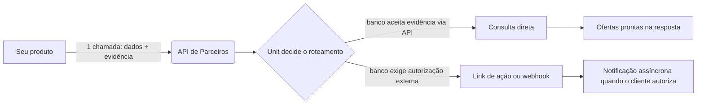

<Note>
  Esta página descreve a especificação de referência (v1) da API de
  Parceiros. Para obter credenciais de acesso (API key e configuração de
  webhook), fale com o time de parceiros da Unit.
</Note>

## Visão geral

Sua aplicação já coleta os dados do cliente e o consentimento dele. Em vez de
integrar banco a banco, você faz **uma única chamada** para a Unit com os
dados do titular e a evidência de autorização — a Unit decide, banco a banco,
como rotear:



Você recebe, numa resposta só: as ofertas dos bancos que aceitaram a
evidência direto, e as ações pendentes (ou notificações futuras via webhook)
dos bancos que exigem uma autorização externa do titular.

## Como isso se encaixa no seu fluxo

Você não precisa mudar a experiência do seu produto — a API de Parceiros
entra depois que você já tem os dados e o consentimento do cliente:

<Steps>
  <Step title="Colete os dados do titular">
    CPF, nome completo, data de nascimento, telefone e e-mail — o que você já
    coleta hoje no seu onboarding.
  </Step>
  <Step title="Colete o consentimento e a evidência">
    Apresente o termo de autorização para consulta de margem/vínculo no seu
    produto e registre a evidência do aceite: IP do titular, geolocalização e
    o momento do aceite.
  </Step>
  <Step title="Chame a API de Parceiros">
    Envie os dados e a evidência para o endpoint de consulta (abaixo). É a
    única chamada necessária para consultar todos os bancos habilitados para
    a sua parceria.
  </Step>
  <Step title="Trate a resposta">
    Mostre as ofertas retornadas. Para bancos que exigem autorização externa,
    apresente o link de ação para o cliente completar (ex.: biometria).
  </Step>
  <Step title="Receba atualizações assíncronas (quando aplicável)">
    Bancos assíncronos, ou autorizações externas concluídas depois da
    resposta inicial, chegam via [webhook](#webhooks) — não é preciso ficar
    consultando o status.
  </Step>
</Steps>

<Note>
  A formalização completa da proposta ainda não faz parte desta versão da
  API — veja [O que acontece depois da oferta](#o-que-acontece-depois-da-oferta).
</Note>

## Autenticação

Toda chamada usa uma API key exclusiva do seu parceiro, enviada no header:

```
X-Partner-Api-Key: <sua-api-key>
```

<Warning>
  Trate sua API key como um segredo — nunca a exponha em código
  client-side/frontend. Todas as chamadas devem partir do seu backend.
</Warning>

## Enviando uma consulta

<CodeGroup>

```bash cURL
curl -X POST https://api.unit.com.br/partners/v1/consultas \
  -H "X-Partner-Api-Key: <sua-api-key>" \
  -H "Content-Type: application/json" \
  -d '{
    "cpf": "12345678900",
    "nome": "Fulano de Tal",
    "data_nascimento": "1990-01-31",
    "telefone": "5511999998888",
    "email": "fulano@example.com",
    "client_ip": "200.0.0.1",
    "geolocation": { "lat": -23.5, "lng": -46.6 }
  }'
```

</CodeGroup>

### Corpo da requisição

<ParamField body="cpf" type="string" required>
  CPF do titular, apenas dígitos.
</ParamField>

<ParamField body="nome" type="string" required>
  Nome completo do titular.
</ParamField>

<ParamField body="data_nascimento" type="string" required>
  Data de nascimento no formato `YYYY-MM-DD`.
</ParamField>

<ParamField body="telefone" type="string" required>
  Telefone do titular com DDI e DDD (ex.: `5511999998888`).
</ParamField>

<ParamField body="email" type="string" required>
  E-mail do titular.
</ParamField>

<ParamField body="client_ip" type="string" required>
  IP do titular **no momento do aceite** — parte da evidência de autorização.
  Como sua chamada é feita pelo seu backend, este campo precisa vir
  explícito: a Unit não tem como inferir o IP do seu cliente a partir da sua
  infraestrutura.
</ParamField>

<ParamField body="geolocation" type="object">
  Geolocalização do titular no momento do aceite — `{ "lat": number, "lng": number }`.
  Recomendado; alguns bancos usam esse dado como parte da evidência.
</ParamField>

<ParamField body="device_evidence" type="object">
  Bloco opcional para elevar a força da evidência em bancos que aceitam
  autorização "tipo app": `authorization_id`, `signature_date` e um objeto
  `evidence` com `user_agent`, `operational_system`, `device_model`,
  `device_name`, `device_type` e `geo_location`. Nenhum banco exige esse
  bloco hoje — use se você já capturar esses dados de device na sua própria
  integração.
</ParamField>

### Resposta

```json
{
  "offers": [
    {
      "provider": "banco_x",
      "loan_value": 5000.00,
      "installment_value": 210.50,
      "installments": 36,
      "interest_rate": 1.85,
      "total_amount": 7578.00
    }
  ],
  "pending_actions": [
    {
      "provider": "banco_y",
      "type": "biometria",
      "action_url": "https://...",
      "message": "Cliente precisa completar a verificação biométrica"
    }
  ],
  "errors": [],
  "elapsed_ms": 1420,
  "timestamp": "2026-07-01T14:32:00Z"
}
```

<ResponseField name="offers" type="array">
  Ofertas prontas dos bancos que aceitaram a evidência via API e já
  retornaram condições de crédito.
</ResponseField>

<ResponseField name="pending_actions" type="array">
  Ações que o titular precisa completar fora do seu produto, no canal do
  banco (ex.: link de biometria). O resultado final chega por
  [webhook](#webhooks).
</ResponseField>

<ResponseField name="errors" type="array">
  Bancos que falharam ou recusaram a operação, com o motivo.
</ResponseField>

## Modelo de autorização por banco

Nem todos os bancos aceitam a evidência da mesma forma. Alguns autorizam a
consulta direto com os dados enviados na chamada; outros exigem uma ação
externa do titular:

| Banco | Autorização | Como |
|---|---|---|
| Unit (parceiros bancários próprios) | Via API | assinatura eletrônica com a evidência enviada na chamada |
| HubCrédito | Via API | termo assinado programaticamente com geolocalização |
| Zipdin | Via API | evidência enviada na chamada |
| Facta | Via API | autorização automática; raramente pode exigir confirmação adicional por SMS/WhatsApp |
| C6 | Externa | biometria/prova de vida — o cliente completa por um link, resultado assíncrono |
| Banco PAN | Externa | autorização via WhatsApp, sempre assíncrona |

<Note>
  A cobertura de bancos disponível para a sua integração depende do seu
  contrato de parceria — confirme com o time de parceiros da Unit quais
  bancos estão habilitados para você.
</Note>

<Warning>
  Banco PAN ainda não faz parte do fluxo automatizado da API de Parceiros —
  está em desenvolvimento. Ele aparece nesta tabela pelo modelo de
  autorização, mas hoje não retorna oferta nem ação pendente por esta API.
</Warning>

## O que acontece depois da oferta

Depois que o cliente escolhe uma oferta, a operação ainda precisa ser
**formalizada com o banco** — e isso exige um segundo conjunto de dados, que
a consulta de evidência (acima) não cobre:

- Endereço completo (CEP, logradouro, número, bairro, cidade, UF)
- Dados bancários ou chave PIX para o desembolso
- Documento de identidade (RG, órgão emissor, data de emissão)
- Estado civil
- Dados de emprego e renda

Cada banco tem um fluxo de formalização próprio, com requisitos e prazos
diferentes entre si. Hoje essa etapa acontece numa experiência hospedada pela
própria Unit — direcione o cliente para lá a partir da oferta escolhida (fale
com o time de parceiros para obter o link de handoff). Uma API unificada de
submissão está no roadmap.

<Tip>
  Se seu produto já coleta esses dados (endereço, dados bancários, documento),
  avise o time de parceiros — isso ajuda a priorizar quais bancos entram
  primeiro numa futura API de submissão.
</Tip>

## Webhooks

Para bancos assíncronos e para autorizações externas que se completam depois
da resposta inicial, a Unit notifica sua aplicação via webhook, na URL
configurada no cadastro do seu parceiro.

### Payload

```json
{
  "partner_id": "sua-empresa",
  "external_reference": "12345678900",
  "provider": "c6",
  "event": "authorization_result",
  "status": "approved",
  "offers": [
    {
      "provider": "c6",
      "loan_value": 5000.00,
      "installment_value": 210.50,
      "installments": 36,
      "interest_rate": 1.85,
      "total_amount": 7578.00
    }
  ],
  "timestamp": "2026-07-01T14:32:00Z"
}
```

### Verificando a assinatura

Toda chamada de webhook inclui um header `X-Unit-Signature` com um HMAC-SHA256
do corpo da requisição, assinado com o webhook secret do seu cadastro.
Valide a assinatura antes de processar o payload:

<CodeGroup>

```javascript Node.js
const crypto = require('crypto')

function isValidSignature(rawBody, signature, secret) {
  const expected = crypto
    .createHmac('sha256', secret)
    .update(rawBody)
    .digest('hex')

  return crypto.timingSafeEqual(
    Buffer.from(expected),
    Buffer.from(signature)
  )
}
```

```python Python
import hashlib
import hmac

def is_valid_signature(raw_body: bytes, signature: str, secret: str) -> bool:
    expected = hmac.new(secret.encode(), raw_body, hashlib.sha256).hexdigest()
    return hmac.compare_digest(expected, signature)
```

</CodeGroup>

<Warning>
  Sempre compare assinaturas com uma função de comparação em tempo constante
  (`timingSafeEqual`/`compare_digest`) — nunca com `===` ou `==`, que vazam
  tempo de execução e enfraquecem a proteção.
</Warning>

Seu endpoint deve responder `2xx` para confirmar o recebimento. Chamadas sem
confirmação são reenviadas com backoff.

## Fora do escopo desta versão

- **Formalização via API** — veja [O que acontece depois da oferta](#o-que-acontece-depois-da-oferta).
  Assinatura digital do contrato e coleta de dados complementares ainda
  acontecem numa página hospedada pela Unit, não pela API de Parceiros.
- **Submissão automatizada do Banco PAN** — ainda em desenvolvimento; não
  retorna oferta nem ação pendente por esta API hoje.
- **Cobertura de bancos** — varia por parceiro; alguns bancos podem não estar
  disponíveis para todas as integrações.

<Tip>
  Dúvidas sobre a integração? Fale com o time de parceiros da Unit.
</Tip>
