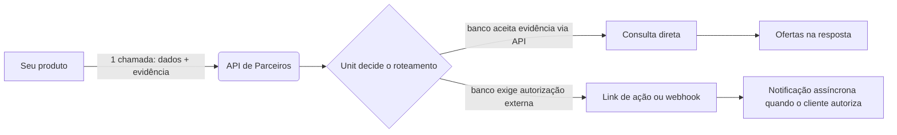

<Note>
  A **consulta/cotação** e a **formalização** desta API estão **implementadas e
  disponíveis**: as rotas `/partners/v1/*` — incluindo a submissão de dados
  complementares, o link de assinatura e o acompanhamento de status descritos em
  [Formalizando uma proposta](#formalizando-uma-proposta) — já estão no ar. O
  **ato de assinar** continua acontecendo no fluxo regulado do próprio banco
  (ZipSign, biometria, DATAPREV); a API entrega o link para o cliente completar.
  Para obter credenciais (API key e configuração de webhook), fale com o time de
  parceiros da Unit.
</Note>

## Visão geral

Sua aplicação já coleta os dados do cliente e o consentimento dele. Em vez de
integrar banco a banco, você faz **uma única chamada** para a Unit com os dados
do titular e a evidência de autorização — a Unit decide, banco a banco, como
rotear:



Você recebe, numa resposta só, o resultado de cada banco: as **ofertas** dos
que aceitaram a evidência direto, e as **ações pendentes** (link de biometria,
DATAPREV, etc.) dos que exigem uma autorização externa do titular — mais o
**erro** ou o motivo, por banco, quando não houver oferta.

## Como isso se encaixa no seu fluxo

Você não precisa mudar a experiência do seu produto — a API de Parceiros entra
depois que você já tem os dados e o consentimento do cliente:

<Steps>
  <Step title="Colete os dados do titular">
    CPF, nome completo, data de nascimento, telefone e e-mail — o que você já
    coleta hoje no seu onboarding.
  </Step>
  <Step title="Colete o consentimento e a evidência">
    Apresente o termo de autorização para consulta de margem/vínculo no seu
    produto e registre a evidência do aceite: IP do titular, geolocalização e o
    momento do aceite.
  </Step>
  <Step title="Chame a API de Parceiros">
    Envie os dados e a evidência para uma das rotas de consulta (abaixo). Numa
    chamada só você consulta todos os bancos habilitados para a sua parceria —
    ou um subconjunto, ou um banco específico.
  </Step>
  <Step title="Trate a resposta">
    Mostre as ofertas retornadas. Para bancos que exigem autorização externa,
    apresente o link de ação para o cliente completar (ex.: biometria).
  </Step>
  <Step title="Receba atualizações assíncronas (quando aplicável)">
    Bancos assíncronos, ou autorizações externas concluídas depois da resposta
    inicial, chegam via [webhook](#webhooks) — não é preciso ficar consultando
    o status.
  </Step>
</Steps>

## Autenticação

Toda chamada usa uma API key exclusiva do seu parceiro, enviada no header:

```
X-Partner-Api-Key: <sua-api-key>
```

A Unit resolve a sua parceria a partir dessa key. Requisições sem a key, com
key inválida ou com a parceria suspensa recebem **`401`**.

<Warning>
  Trate sua API key como um segredo — nunca a exponha em código
  client-side/frontend. Todas as chamadas devem partir do seu backend.
</Warning>

## Bancos habilitados

Quais bancos a sua integração pode consultar é definido em **duas camadas**:

1. **Allowlist da parceria (fixo, no servidor).** Cada parceria tem uma lista
   de bancos permitidos, definida no seu contrato. A Unit aplica esse limite
   **sempre** — uma chamada nunca alcança um banco fora do seu allowlist.
2. **Seleção por chamada (opcional, dentro do allowlist).** Em cada requisição
   você pode restringir ainda mais quais bancos consultar, com o campo
   `providers` (veja abaixo). Ausente, a consulta usa **todo** o seu allowlist.

<Note>
  A cobertura de bancos disponível para a sua integração depende do seu
  contrato de parceria — confirme com o time de parceiros da Unit quais bancos
  estão habilitados para você.
</Note>

## Enviando uma consulta

Há três formas de consultar, todas com o mesmo corpo de requisição:

| Rota | Uso |
|---|---|
| `POST /partners/v1/consultas` | **Agregada, síncrona.** Consulta os bancos em paralelo e devolve tudo quando terminam. |
| `POST /partners/v1/consultas/stream` | **Agregada, streaming (SSE).** Emite o resultado de cada banco à medida que ele responde. |
| `POST /partners/v1/providers/{name}/consultas` | **Individual.** Consulta um único banco (dentro do seu allowlist) e devolve um envelope só. |

<CodeGroup>

```bash Agregada
curl -X POST https://api.somosunit.com.br/partners/v1/consultas \
  -H "X-Partner-Api-Key: <sua-api-key>" \
  -H "Content-Type: application/json" \
  -d '{
    "cpf": "12345678900",
    "nome": "Fulano de Tal",
    "data_nascimento": "1990-01-31",
    "telefone": "5511999998888",
    "email": "fulano@example.com",
    "client_ip": "200.0.0.1",
    "geolocation": { "lat": -23.5, "lng": -46.6 },
    "providers": ["unit", "c6"]
  }'
```

```bash Streaming (SSE)
curl -N -X POST https://api.somosunit.com.br/partners/v1/consultas/stream \
  -H "X-Partner-Api-Key: <sua-api-key>" \
  -H "Content-Type: application/json" \
  -d '{
    "cpf": "12345678900",
    "nome": "Fulano de Tal",
    "data_nascimento": "1990-01-31",
    "telefone": "5511999998888",
    "email": "fulano@example.com",
    "client_ip": "200.0.0.1"
  }'
```

```bash Individual
curl -X POST https://api.somosunit.com.br/partners/v1/providers/c6/consultas \
  -H "X-Partner-Api-Key: <sua-api-key>" \
  -H "Content-Type: application/json" \
  -d '{
    "cpf": "12345678900",
    "nome": "Fulano de Tal",
    "data_nascimento": "1990-01-31",
    "telefone": "5511999998888",
    "email": "fulano@example.com",
    "client_ip": "200.0.0.1"
  }'
```

</CodeGroup>

### Corpo da requisição

<ParamField body="cpf" type="string" required>
  CPF do titular, apenas dígitos.
</ParamField>

<ParamField body="nome" type="string" required>
  Nome completo do titular.
</ParamField>

<ParamField body="data_nascimento" type="string" required>
  Data de nascimento no formato `YYYY-MM-DD`.
</ParamField>

<ParamField body="telefone" type="string" required>
  Telefone do titular com DDI e DDD (ex.: `5511999998888`).
</ParamField>

<ParamField body="email" type="string" required>
  E-mail do titular.
</ParamField>

<ParamField body="client_ip" type="string" required>
  IP do titular **no momento do aceite** — parte da evidência de autorização.
  Como sua chamada é feita pelo seu backend, este campo precisa vir explícito: a
  Unit não tem como inferir o IP do seu cliente a partir da sua infraestrutura.
</ParamField>

<ParamField body="geolocation" type="object">
  Geolocalização do titular no momento do aceite — `{ "lat": number, "lng": number }`.
  Recomendado; alguns bancos usam esse dado como parte da evidência.
</ParamField>

<ParamField body="providers" type="string[]">
  Restringe esta chamada a um subconjunto dos bancos (ex.: `["unit", "c6"]`). O
  resultado é sempre a **interseção** com o allowlist da sua parceria — pedir um
  banco fora do allowlist não o inclui. Ausente, consulta todo o allowlist.
  (Ignorado na rota individual, que já mira um banco pelo path.)
</ParamField>

<ParamField body="sexo" type="integer" default="0">
  Sexo do titular, quando exigido por algum banco na simulação.
</ParamField>

<ParamField body="app_authorization" type="object">
  Bloco opcional para elevar a força da evidência em bancos que aceitam
  autorização "tipo app": `authorizationId`, `signatureDate` e um objeto
  `evidence` com `userAgent`, `operationalSystem`, `deviceModel`, `deviceName`,
  `deviceType` e `geoLocation`. Use se você já capturar esses dados de device na
  sua própria integração.
</ParamField>

<ParamField body="originador" type="string">
  Identificador de originação/atribuição, quando aplicável ao seu contrato.
</ParamField>

<ParamField body="loan_value" type="number">
  Valor de empréstimo desejado, para direcionar a simulação. Opcional.
</ParamField>

<ParamField body="prazo" type="integer">
  Prazo desejado (nº de parcelas), para direcionar a simulação. Opcional.
</ParamField>

<ParamField body="valor_parcela" type="number">
  Valor de parcela desejado, para direcionar a simulação. Opcional.
</ParamField>

<ParamField body="with_insurance" type="boolean" default="true">
  Inclui as opções com seguro na simulação.
</ParamField>

### Resposta — consulta agregada

A rota agregada devolve, numa resposta só, as ofertas achatadas (ordenadas por
valor) e o resultado detalhado por banco:

```json
{
  "proposals": [
    {
      "provider": "c6",
      "loanValue": 5000.00,
      "installmentValue": 210.50,
      "installments": 36,
      "interestRate": 1.85,
      "totalAmount": 7578.00,
      "tableCode": "T-123",
      "firstDueDate": "2026-08-05",
      "employerName": "Empresa X",
      "employerCnpj": "00000000000191",
      "matricula": "998877"
    }
  ],
  "providerResults": {
    "c6": {
      "provider": "c6",
      "success": true,
      "proposals": [ /* mesmas ofertas deste banco */ ],
      "vinculos": [],
      "error": null,
      "elapsedMs": 1420,
      "noProposalReasons": [],
      "requiresSignature": false,
      "signatureUrl": null,
      "termAutoAuthorized": false
    }
  },
  "employers": [],
  "elapsedMs": 1620,
  "timestamp": "2026-07-01T14:32:00Z",
  "simulationGroupId": "a1b2c3"
}
```

<ResponseField name="proposals" type="array">
  Todas as ofertas de todos os bancos, achatadas e ordenadas por valor. Cada
  oferta traz `provider`, `loanValue`, `installmentValue`, `installments`,
  `interestRate`, `totalAmount` e detalhes do vínculo (`employerName`,
  `employerCnpj`, `matricula`), além de `providerData` com campos específicos do
  banco.
</ResponseField>

<ResponseField name="providerResults" type="object">
  Resultado detalhado **por banco**, indexado pelo nome do banco. É onde você lê
  o estado de cada um:
  <ul>
    <li>**Ofertas do banco** → `proposals`.</li>
    <li>**Ação pendente** (autorização externa) → `requiresSignature: true` com
      `signatureUrl`, e/ou `noProposalReasons` explicando o que falta.</li>
    <li>**Erro / recusa** → `success: false` com `error`.</li>
  </ul>
</ResponseField>

<ResponseField name="employers" type="array">
  Vínculos empregatícios encontrados para o titular, quando aplicável.
</ResponseField>

<ResponseField name="elapsedMs" type="integer">
  Tempo total da consulta agregada, em milissegundos.
</ResponseField>

<ResponseField name="simulationGroupId" type="string | null">
  Identificador do grupo de simulação, quando a consulta persiste as ofertas.
</ResponseField>

### Resposta — streaming (SSE)

A rota `/consultas/stream` responde `text/event-stream`: cada evento é uma linha
`data: {json}\n\n` com uma chave `event`. Os bancos chegam à medida que
respondem, sem esperar o mais lento:

| `event` | Quando | Campos |
|---|---|---|
| `start` | início da consulta | `message` |
| `provider_start` | um banco começou | `provider` |
| `provider_result` | um banco respondeu | `provider`, `success`, `proposals`, `vinculos`, `error`, `elapsedMs`, `noProposalReasons`, `requiresSignature`, `signatureUrl` |
| `provider_error` | um banco falhou de forma inesperada | `error` |
| `complete` | todos terminaram | — |

<Note>
  O streaming entrega os resultados progressivos por banco, mas **não** dispara
  os efeitos cross-provider da rota síncrona (webhooks de lead, persistência das
  ofertas). Se você depende desses efeitos, use a rota agregada síncrona
  (`POST /partners/v1/consultas`).
</Note>

### Resposta — consulta individual

A rota individual devolve um único **envelope** do banco consultado (campos em
`snake_case`):

```json
{
  "provider": "c6",
  "status": "requires_action",
  "offers": [
    {
      "provider": "c6",
      "loan_value": 5000.00,
      "installment_value": 210.50,
      "installments": 36,
      "interest_rate": 1.85,
      "total_amount": 7578.00,
      "table_code": "T-123",
      "first_due_date": "2026-08-05"
    }
  ],
  "vinculos": [],
  "proposal_id": null,
  "action": { "type": "biometria", "url": "https://...", "detail": null },
  "error": null,
  "elapsed_ms": 1420,
  "no_proposal_reasons": [],
  "term_auto_authorized": false,
  "provider_data": null
}
```

<ResponseField name="status" type="string">
  Estado normalizado do banco: `ok` (com oferta), `no_offers` (sem oferta),
  `requires_action` (precisa de autorização externa), `pending` (fluxo
  assíncrono em andamento) ou `error`.
</ResponseField>

<ResponseField name="offers" type="array">
  Ofertas deste banco.
</ResponseField>

<ResponseField name="action" type="object | null">
  Ação pendente quando `status: requires_action` — `type`
  (`signature` | `biometria` | `dataprev` | `whatsapp_link` | `formalization`),
  `url` (o link para o cliente completar) e `detail`.
</ResponseField>

<ResponseField name="error" type="string | null">
  Motivo, quando o banco falhou ou recusou.
</ResponseField>

<Note>
  Pedir um banco fora do seu allowlist retorna **`403`** (não `404` — a API não
  revela se o banco existe). Um nome de banco desconhecido retorna `404`.
</Note>

## Modelo de autorização por banco

Nem todos os bancos aceitam a evidência da mesma forma. Alguns autorizam a
consulta direto com os dados enviados na chamada; outros exigem uma ação externa
do titular:

| Banco | Autorização | Como |
|---|---|---|
| Unit (parceiros bancários próprios) | Via API | assinatura eletrônica com a evidência enviada na chamada |
| HubCrédito | Via API | termo assinado programaticamente com geolocalização |
| Zipdin | Via API | evidência enviada na chamada |
| Facta | Via API | autorização automática via DATAPREV; raramente pode exigir confirmação adicional por SMS/WhatsApp |
| C6 | Externa | biometria/prova de vida — o cliente completa por um link, resultado assíncrono |
| Banco PAN | Externa | autorização via WhatsApp, sempre assíncrona |

<Warning>
  Banco PAN ainda não faz parte do fluxo automatizado da API de Parceiros — está
  em desenvolvimento. Ele aparece nesta tabela pelo modelo de autorização, mas
  hoje não retorna oferta nem ação pendente por esta API.
</Warning>

## Formalizando uma proposta

Depois que o cliente escolhe uma oferta, a operação ainda precisa ser
**formalizada com o banco** — e isso exige um segundo conjunto de dados, que a
consulta de evidência (acima) não cobre: endereço completo, dados bancários ou
chave PIX para o desembolso, documento de identidade, estado civil e dados de
emprego e renda. A API de Parceiros cobre também essa etapa — submissão dos
dados complementares, link de assinatura e acompanhamento de status — nas
mesmas rotas `/partners/v1/proposals*`.

<Steps>
  <Step title="Escolha uma oferta">
    Use o `provider` e o identificador da oferta retornados na consulta (ver
    `offer_ref` abaixo).
  </Step>
  <Step title="Submeta os dados complementares">
    `POST /proposals` com a oferta escolhida (`offer_ref`) e o dataset de
    submissão (endereço, documento, dados bancários/PIX etc.). A resposta traz
    o `proposal_id` — nosso identificador estável para o restante do fluxo.
  </Step>
  <Step title="Peça o link de assinatura">
    `POST /proposals/{proposal_id}/formalize` devolve `action.url`: o link
    para o cliente completar a assinatura no fluxo do banco (ZipSign,
    biometria, DATAPREV etc.).
  </Step>
  <Step title="Acompanhe o status">
    `GET /proposals/{proposal_id}` devolve o status normalizado a qualquer
    momento, sem que você precise reimplementar o fluxo de cada banco.
  </Step>
</Steps>

### Rotas

| Rota | Uso |
|---|---|
| `POST /partners/v1/proposals` | Submete a oferta escolhida + os dados complementares. Devolve `proposal_id`. |
| `POST /partners/v1/proposals/{proposal_id}/formalize` | Dispara/retorna o link de assinatura (`action.url`). |
| `GET /partners/v1/proposals/{proposal_id}` | Status normalizado da proposta. |
| `POST /partners/v1/proposals/{proposal_id}/cancel` | Cancela a proposta. Hoje só a **Facta** suporta — os demais bancos devolvem `501` normalizado. |

<Note>
  O ato de assinar acontece no fluxo regulado do banco (ZipSign, biometria C6,
  DATAPREV, Unit-sign) — a API de Parceiros entrega o link e o status; ela não
  captura a assinatura.
</Note>

### Dataset de submissão

`POST /proposals` recebe **um objeto único**, o mesmo para todos os bancos. A
API valida o subconjunto exigido pelo banco-alvo e devolve **`422`** com o(s)
campo(s) faltando, antes de qualquer chamada ao banco.

```json
{
  "offer_ref": { "provider": "c6", "offer_id": "998877" },
  "titular": {
    "nome": "Fulano de Tal",
    "cpf": "12345678900",
    "data_nascimento": "1990-01-31",
    "sexo": "M",
    "nome_mae": "Ciclana de Tal",
    "estado_civil": "solteiro"
  },
  "documento": {
    "numero": "1234567",
    "orgao_emissor": "SSP",
    "uf_emissor": "SP",
    "data_emissao": "2015-03-10"
  },
  "contato": { "telefone": "5511999998888", "email": "fulano@example.com" },
  "endereco": {
    "cep": "01310100",
    "logradouro": "Av. Paulista",
    "numero": "1000",
    "bairro": "Bela Vista",
    "cidade": "São Paulo",
    "uf": "SP"
  },
  "vinculo": {
    "cnpj_empregador": "00000000000191",
    "nome_empregador": "Empresa X",
    "cargo": "Analista",
    "salario": 4500.00,
    "matricula": "998877"
  },
  "recebimento": {
    "conta_bancaria": {
      "banco": "001",
      "agencia": "1234",
      "conta": "56789",
      "digito_conta": "0",
      "tipo_conta": "corrente"
    }
  },
  "assinatura": { "ip": "200.0.0.1" }
}
```

<ParamField body="offer_ref" type="object" required>
  A oferta escolhida — `{ provider, offer_id }`. `offer_id` é o identificador
  da oferta que veio na consulta (ex.: `providerData` do banco: `id_simulador`
  na Facta, `id_simulacao` no C6, `proposalNumber`/`preRegisterId` na Zipdin,
  `auctionProposalKey` na Unit).
</ParamField>

<ParamField body="titular" type="object" required>
  Dados do titular: `nome`, `cpf`, `data_nascimento`, `sexo` (`"M"` ou `"F"` —
  normalizado; a API traduz para o código de cada banco), `nome_mae`, e,
  conforme o banco, `nome_pai`, `nacionalidade`, `estado_civil`,
  `naturalidade_cidade`, `naturalidade_uf`, `exposicao_politica`.
</ParamField>

<ParamField body="documento" type="object">
  Documento de identidade (RG): `numero`, `orgao_emissor`, `uf_emissor`,
  `data_emissao`. Exigido pela maioria dos bancos — ver matriz abaixo.
</ParamField>

<ParamField body="contato" type="object" required>
  `telefone` e `email` do titular.
</ParamField>

<ParamField body="endereco" type="object" required>
  Endereço completo: `cep`, `logradouro`, `numero`, `complemento` (opcional),
  `bairro`, `cidade`, `uf`.
</ParamField>

<ParamField body="vinculo" type="object">
  Dados de emprego e renda: `cnpj_empregador`, `nome_empregador`, `cargo`,
  `salario`, `margem`, `data_admissao`, `matricula`. Exigência varia por
  banco — ver matriz abaixo.
</ParamField>

<ParamField body="recebimento" type="object" required>
  Para onde o crédito é desembolsado — **exatamente um** dos dois:
  `conta_bancaria` (`banco`, `agencia`, `digito_agencia` opcional, `conta`,
  `digito_conta`, `tipo_conta`) ou `pix` (`tipo_chave`, `chave`). Enviar os
  dois, ou nenhum, retorna `422`.
</ParamField>

<ParamField body="assinatura" type="object" required>
  `ip` — IP do titular no momento do aceite. `tipo_envio` (`"sms"` ou
  `"whatsapp"`) controla como o link de assinatura é entregue, quando o banco
  suportar.
</ParamField>

#### Matriz de exigência por banco

Cada bloco é obrigatório, opcional ou irrelevante conforme o banco. Campos
faltando para o banco-alvo retornam `422` com o campo, antes de qualquer
chamada externa.

| Bloco | Zipdin | Unit | C6 | Facta |
|---|:--:|:--:|:--:|:--:|
| `endereco` | obrigatório | obrigatório | obrigatório | obrigatório |
| `recebimento` | conta ou PIX | conta ou PIX¹ | só conta | conta ou PIX |
| `documento` (RG) | obrigatório | obrigatório | — | obrigatório |
| `titular.estado_civil` | obrigatório | obrigatório | — | obrigatório |
| `titular.nome_mae` | obrigatório | obrigatório | — | obrigatório |
| `titular.nome_pai` / naturalidade | opcional | — | — | obrigatório |
| `vinculo` | obrigatório² | opcional | — | obrigatório (CNPJ + admissão + renda) |
| `titular.sexo` | obrigatório | opcional | — | obrigatório |
| `assinatura.ip` | — | obrigatório | — | — |
| `assinatura.tipo_envio` | — | — | — | obrigatório (envio do link) |

¹ Na Unit, PIX é bloqueado para propostas roteadas para a carteira BMP — a
validação recusa `pix` nesse caso, com mensagem clara.
² Na Zipdin, `vinculo` cobre apenas cargo/empregador — não inclui renda.

### Envelope de resposta

`submit`, `formalize` e `status` devolvem o **mesmo envelope** — você escreve
um handler de status e um de erro, independente do banco:

```json
{
  "proposal_id": "a1b2c3d4",
  "provider": "c6",
  "status": "awaiting_signature",
  "action": {
    "type": "signature",
    "url": "https://exemplo.bank/assinatura/xyz",
    "delivery": null
  },
  "offer": {
    "loanValue": 5000.00,
    "installmentValue": 210.50,
    "installments": 36,
    "interestRate": 1.85
  },
  "error": null,
  "provider_data": null,
  "updated_at": "2026-07-01T14:40:00Z"
}
```

<ResponseField name="proposal_id" type="string">
  Nosso identificador opaco e estável da proposta — use-o em `formalize`,
  `status` e `cancel`.
</ResponseField>

<ResponseField name="status" type="string">
  Estado normalizado da proposta (enum abaixo).
</ResponseField>

<ResponseField name="action" type="object | null">
  Link de assinatura quando `status: awaiting_signature` — `type: "signature"`,
  `url` (o link para o cliente completar) e `delivery`.
</ResponseField>

<ResponseField name="offer" type="object | null">
  A oferta associada à proposta (`loanValue`, `installmentValue`,
  `installments`, `interestRate`, ...).
</ResponseField>

<ResponseField name="error" type="object | null">
  Erro normalizado, quando houver — `code`, `message`, `retryable` e `field`
  (ver tabela de códigos abaixo).
</ResponseField>

<ResponseField name="provider_data" type="object | null">
  Extensão crua por banco: identificadores e status originais, para quem
  precisar do detalhe.
</ResponseField>

#### Status normalizado

| `status` | Significado |
|---|---|
| `created` | Proposta submetida ao banco. |
| `awaiting_signature` | Link de assinatura disponível, aguardando o cliente. |
| `approved` | Proposta aprovada/averbada. |
| `disbursed` | Crédito liberado. |
| `paid` | Proposta paga. |
| `rejected` | Proposta negada. |
| `canceled` | Proposta cancelada. |

#### Códigos de erro

O contrato de erro é **normalizado** — um handler para o parceiro, não um por
banco. `error.code` é estável entre bancos; `retryable` indica se vale a pena
tentar de novo; `field` aponta o campo, quando aplicável.

| `code` | HTTP | Quando |
|---|:--:|---|
| `invalid_input` | 422 | Campo faltando ou inválido — detectado antes de chamar o banco. |
| `offer_expired` | 409 | A taxa/política/margem da oferta mudou desde a consulta. |
| `provider_rejected` | 422 | O banco recusou a proposta (prazo, margem, assinatura). |
| `authorization_expired` | 409 | Autorização/DATAPREV vencida. |
| `duplicate` | 409 | Já existe uma proposta em andamento para este titular/banco. |
| `provider_unavailable` | 502 | Banco fora do ar ou timeout. |
| `provider_error` | 502 | Erro inesperado do banco. |
| `not_found` | 404 | `proposal_id` desconhecido (ou de outro parceiro — ver segurança abaixo). |

### Segurança

<Warning>
  `proposal_id` é escopado ao seu parceiro: só quem submeteu a proposta pode
  formalizá-la, consultá-la ou cancelá-la. Tentar acessar a proposta de outro
  parceiro (ou fora da sua allowlist de bancos) retorna `404`.
</Warning>

### Exemplo

<CodeGroup>

```bash Submeter
curl -X POST https://api.somosunit.com.br/partners/v1/proposals \
  -H "X-Partner-Api-Key: au_xxxxxxxx" \
  -H "Content-Type: application/json" \
  -d '{
    "offer_ref": { "provider": "c6", "offer_id": "998877" },
    "titular": {
      "nome": "Fulano de Tal",
      "cpf": "12345678900",
      "data_nascimento": "1990-01-31",
      "sexo": "M",
      "nome_mae": "Ciclana de Tal"
    },
    "contato": { "telefone": "5511999998888", "email": "fulano@example.com" },
    "endereco": {
      "cep": "01310100",
      "logradouro": "Av. Paulista",
      "numero": "1000",
      "bairro": "Bela Vista",
      "cidade": "São Paulo",
      "uf": "SP"
    },
    "recebimento": {
      "conta_bancaria": {
        "banco": "001",
        "agencia": "1234",
        "conta": "56789",
        "digito_conta": "0",
        "tipo_conta": "corrente"
      }
    },
    "assinatura": { "ip": "200.0.0.1" }
  }'
```

```bash Formalizar
curl -X POST https://api.somosunit.com.br/partners/v1/proposals/a1b2c3d4/formalize \
  -H "X-Partner-Api-Key: au_xxxxxxxx"
```

```bash Status
curl https://api.somosunit.com.br/partners/v1/proposals/a1b2c3d4 \
  -H "X-Partner-Api-Key: au_xxxxxxxx"
```

</CodeGroup>

Resposta de `formalize`, com o link de assinatura pronto:

```json
{
  "proposal_id": "a1b2c3d4",
  "provider": "c6",
  "status": "awaiting_signature",
  "action": {
    "type": "signature",
    "url": "https://exemplo.bank/assinatura/xyz",
    "delivery": null
  },
  "offer": null,
  "error": null,
  "provider_data": null,
  "updated_at": "2026-07-01T14:40:00Z"
}
```

## Sandbox de Homologação

Antes de integrar em produção, teste sua integração no **sandbox** — um
ambiente que responde exatamente como a API real (mesmas rotas, mesmo
contrato, mesmos códigos de erro), mas **100% simulado**: não bate em nenhum
banco de verdade e não usa dados reais.

<Note>
  Base URL do sandbox: `https://sandbox.api.somosunit.com.br`. Chave de teste
  fixa (pública, pode usar livremente): `au_sandbox00000000000000000000000`.
</Note>

### CPFs de teste — catálogo de cenários

| CPF | Cenário |
|---|---|
| `11144477735` | Sucesso em todos os bancos (ofertas reais retornadas) |
| `22255588846` | Sem oferta em todos os bancos (`no_offers`) |
| `33366699957` | Requer ação externa em todos os bancos (assinatura/biometria/DATAPREV) |
| `44477700083` | Erro em todos os bancos |
| `55588811194` | Combo: mistura de desfechos por banco (cenário realista) |
| `66699922203` | Formalização Zipdin completa: submit → link de assinatura → aprovado |
| `77700033340` | Formalização Unit rejeitada pelo banco (prazo fora do limite) |
| `88811144450` | Formalização C6: proposta já em andamento (`duplicate`) |
| `99922255561` | Formalização Facta completa: submit → link → paga → cancelada (+ combo Unit/C6) |
| `10033366632` | Formalização Facta: oferta expirada no submit (`offer_expired`) |

<Note>
  Para testar a formalização da **Unit**, use `POST /partners/v1/consultas`
  (agregada) antes do submit — não `POST /partners/v1/providers/unit/consultas`
  (individual). Só a rota agregada resolve e persiste a oferta que o submit da
  Unit exige (`offer_ref.offer_id` = o `simulationId` retornado em
  `providerData.raw`), igual em produção.
</Note>

## Webhooks

Para bancos assíncronos e para autorizações externas que se completam depois da
resposta inicial (ex.: C6 após a biometria), a Unit notifica sua aplicação via
webhook, na URL configurada no cadastro do seu parceiro.

<Note>
  A configuração de webhook (URL + secret) já faz parte do cadastro do parceiro.
  A **emissão** dos eventos assíncronos acompanha a habilitação dos bancos
  assíncronos (C6 pós-biometria, Banco PAN) — confirme com o time de parceiros o
  que já está ativo para a sua integração.
</Note>

### Payload

```json
{
  "partner_id": "sua-empresa",
  "external_reference": "12345678900",
  "provider": "c6",
  "event": "authorization_result",
  "status": "approved",
  "offers": [ /* mesmo formato de oferta da resposta síncrona */ ],
  "timestamp": "2026-07-01T14:32:00Z"
}
```

### Verificando a assinatura

Toda chamada de webhook inclui um header `X-Unit-Signature` com um HMAC-SHA256
do corpo da requisição, assinado com o webhook secret do seu cadastro. Valide a
assinatura antes de processar o payload:

<CodeGroup>

```javascript Node.js
const crypto = require('crypto')

function isValidSignature(rawBody, signature, secret) {
  const expected = crypto
    .createHmac('sha256', secret)
    .update(rawBody)
    .digest('hex')

  return crypto.timingSafeEqual(
    Buffer.from(expected),
    Buffer.from(signature)
  )
}
```

```python Python
import hashlib
import hmac

def is_valid_signature(raw_body: bytes, signature: str, secret: str) -> bool:
    expected = hmac.new(secret.encode(), raw_body, hashlib.sha256).hexdigest()
    return hmac.compare_digest(expected, signature)
```

</CodeGroup>

<Warning>
  Sempre compare assinaturas com uma função de comparação em tempo constante
  (`timingSafeEqual`/`compare_digest`) — nunca com `===` ou `==`, que vazam
  tempo de execução e enfraquecem a proteção.
</Warning>

Seu endpoint deve responder `2xx` para confirmar o recebimento. Chamadas sem
confirmação são reenviadas com backoff.

<Tip>
  Dúvidas sobre a integração? Fale com o time de parceiros da Unit.
</Tip>
