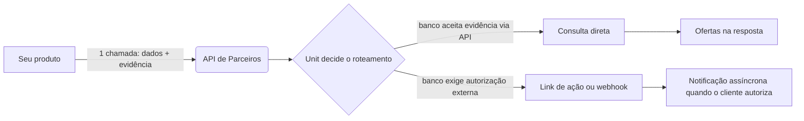

<Note>
  A **consulta/cotação** e a **formalização** desta API estão **implementadas e
  disponíveis**: as rotas `/partners/v1/*` — incluindo a submissão de dados
  complementares, o link de assinatura e o acompanhamento de status descritos em
  [Formalizando uma proposta](#formalizando-uma-proposta) — já estão no ar. O
  **ato de assinar** continua acontecendo no fluxo regulado do próprio banco
  (ZipSign, biometria, DATAPREV); a API entrega o link para o cliente completar.
  A **resolução de pendências de formalização** (V8) também está no ar — ver
  [Resolvendo pendências](#resolvendo-pendências-de-formalização).
  Para obter credenciais (API key e configuração de webhook), fale com o time de
  parceiros da Unit.
</Note>

## Visão geral

Sua aplicação já coleta os dados do cliente e o consentimento dele. Em vez de
integrar banco a banco, você faz **uma única chamada** para a Unit com os dados
do titular e a evidência de autorização — a Unit decide, banco a banco, como
rotear:


```mermaid
flowchart LR
    A[Seu produto] -->|1 chamada: dados + evidência| B(API de Parceiros)
    B --> C{Unit decide o roteamento}
    C -->|banco aceita evidência via API| D[Consulta direta]
    D --> F[Ofertas na resposta]
    C -->|banco exige autorização externa| E[Link de ação ou webhook]
    E --> G[Notificação assíncrona quando o cliente autoriza]
```

Você recebe, numa resposta só, o resultado de cada banco: as **ofertas** dos
que aceitaram a evidência direto, e as **ações pendentes** (link de biometria,
DATAPREV, etc.) dos que exigem uma autorização externa do titular — mais o
**erro** ou o motivo, por banco, quando não houver oferta.

## Como isso se encaixa no seu fluxo

Você não precisa mudar a experiência do seu produto — a API de Parceiros entra
depois que você já tem os dados e o consentimento do cliente:

<Steps>
  <Step title="Colete os dados do titular">
    CPF, nome completo, data de nascimento, telefone e e-mail — o que você já
    coleta hoje no seu onboarding.
  </Step>
  <Step title="Colete o consentimento e a evidência">
    Apresente o termo de autorização para consulta de margem/vínculo no seu
    produto e registre a evidência do aceite: IP do titular, geolocalização e o
    momento do aceite.
  </Step>
  <Step title="Chame a API de Parceiros">
    Envie os dados e a evidência para uma das rotas de consulta (abaixo). Numa
    chamada só você consulta todos os bancos habilitados para a sua parceria —
    ou um subconjunto, ou um banco específico.
  </Step>
  <Step title="Trate a resposta">
    Mostre as ofertas retornadas. Para bancos que exigem autorização externa,
    apresente o link de ação para o cliente completar (ex.: biometria).
  </Step>
  <Step title="Receba atualizações assíncronas (quando aplicável)">
    Bancos assíncronos, ou autorizações externas concluídas depois da resposta
    inicial, chegam via [webhook](#webhooks) — não é preciso ficar consultando
    o status.
  </Step>
</Steps>

## Autenticação

Toda chamada usa uma API key exclusiva do seu parceiro, enviada no header:

```
X-Partner-Api-Key: <sua-api-key>
```

A Unit resolve a sua parceria a partir dessa key. Requisições sem a key, com
key inválida ou com a parceria suspensa recebem **`401`**.

<Warning>
  Trate sua API key como um segredo — nunca a exponha em código
  client-side/frontend. Todas as chamadas devem partir do seu backend.
</Warning>

## Bancos habilitados

Quais bancos a sua integração pode consultar é definido em **duas camadas**:

1. **Allowlist da parceria (fixo, no servidor).** Cada parceria tem uma lista
   de bancos permitidos, definida no seu contrato. A Unit aplica esse limite
   **sempre** — uma chamada nunca alcança um banco fora do seu allowlist.
2. **Seleção por chamada (opcional, dentro do allowlist).** Em cada requisição
   você pode restringir ainda mais quais bancos consultar, com o campo
   `providers` (veja abaixo). Ausente, a consulta usa **todo** o seu allowlist.

<Note>
  A cobertura de bancos disponível para a sua integração depende do seu
  contrato de parceria — confirme com o time de parceiros da Unit quais bancos
  estão habilitados para você.
</Note>

## Enviando uma consulta

Há três formas de consultar, todas com o mesmo corpo de requisição:

| Rota | Uso |
|---|---|
| `POST /partners/v1/consultas` | **Agregada, síncrona.** Consulta os bancos em paralelo e devolve tudo quando terminam. |
| `POST /partners/v1/consultas/stream` | **Agregada, streaming (SSE).** Emite o resultado de cada banco à medida que ele responde. |
| `POST /partners/v1/providers/{name}/consultas` | **Individual.** Consulta um único banco (dentro do seu allowlist) e devolve um envelope só. |

<CodeGroup>

```bash Agregada
curl -X POST https://api.somosunit.com.br/partners/v1/consultas \
  -H "X-Partner-Api-Key: <sua-api-key>" \
  -H "Content-Type: application/json" \
  -d '{
    "cpf": "12345678900",
    "nome": "Fulano de Tal",
    "data_nascimento": "1990-01-31",
    "telefone": "11999998888",
    "email": "fulano@example.com",
    "client_ip": "200.0.0.1",
    "geolocation": { "lat": -23.5, "lng": -46.6 },
    "providers": ["unit", "c6"]
  }'
```

```bash Streaming (SSE)
curl -N -X POST https://api.somosunit.com.br/partners/v1/consultas/stream \
  -H "X-Partner-Api-Key: <sua-api-key>" \
  -H "Content-Type: application/json" \
  -d '{
    "cpf": "12345678900",
    "nome": "Fulano de Tal",
    "data_nascimento": "1990-01-31",
    "telefone": "11999998888",
    "email": "fulano@example.com",
    "client_ip": "200.0.0.1"
  }'
```

```bash Individual
curl -X POST https://api.somosunit.com.br/partners/v1/providers/c6/consultas \
  -H "X-Partner-Api-Key: <sua-api-key>" \
  -H "Content-Type: application/json" \
  -d '{
    "cpf": "12345678900",
    "nome": "Fulano de Tal",
    "data_nascimento": "1990-01-31",
    "telefone": "11999998888",
    "email": "fulano@example.com",
    "client_ip": "200.0.0.1"
  }'
```

</CodeGroup>

### Corpo da requisição

<ParamField body="cpf" type="string" required>
  CPF do titular, apenas dígitos.
</ParamField>

<ParamField body="nome" type="string" required>
  Nome completo do titular.
</ParamField>

<ParamField body="data_nascimento" type="string" required>
  Data de nascimento no formato `YYYY-MM-DD`.
</ParamField>

<ParamField body="telefone" type="string" required>
  Telefone do titular no formato **DDD+número, 10-11 dígitos** (ex.:
  `11999998888`). O DDI `55` é opcional — se vier (`5511999998888`), a API
  remove automaticamente. Qualquer outro formato retorna `422 invalid_input`.
</ParamField>

<ParamField body="email" type="string" required>
  E-mail do titular, em formato válido. Vazio ou inválido retorna
  `422 invalid_input` — o HubCrédito não processa consultas sem e-mail.
</ParamField>

<ParamField body="client_ip" type="string" required>
  IP do titular **no momento do aceite** — parte da evidência de autorização.
  Como sua chamada é feita pelo seu backend, este campo precisa vir explícito: a
  Unit não tem como inferir o IP do seu cliente a partir da sua infraestrutura.
</ParamField>

<ParamField body="geolocation" type="object">
  Geolocalização do titular no momento do aceite — `{ "lat": number, "lng": number }`.
  Recomendado; alguns bancos usam esse dado como parte da evidência.
</ParamField>

<ParamField body="providers" type="string[]">
  Restringe esta chamada a um subconjunto dos bancos (ex.: `["unit", "c6"]`). O
  resultado é sempre a **interseção** com o allowlist da sua parceria — pedir um
  banco fora do allowlist não o inclui. Ausente, consulta todo o allowlist.
  (Ignorado na rota individual, que já mira um banco pelo path.)

  Desde 13/08: se **nenhum** nome pedido estiver no seu allowlist (ex.: typo
  `"pan"` em vez de `"banco_pan"`), a chamada devolve **`422 invalid_input`**
  (`field: "providers"`) listando os bancos disponíveis do seu contrato — em
  vez de responder `200` com `providerResults` vazio.
</ParamField>

<ParamField body="sexo" type="integer" default="0">
  Sexo do titular na **consulta**. Hoje só a **HubCrédito** usa este campo na
  simulação: `0` = masculino, qualquer outro valor (use `1`) = feminino — não
  existe "não informado", o default `0` vai como masculino. Os demais bancos
  ignoram; se a HubCrédito não está no seu allowlist, pode omitir. (Na
  formalização o sexo vai em `titular.sexo` como `"M"`/`"F"`.)
</ParamField>

<ParamField body="app_authorization" type="object">
  Bloco opcional para elevar a força da evidência em bancos que aceitam
  autorização "tipo app": `authorizationId`, `signatureDate` e um objeto
  `evidence` com `userAgent`, `operationalSystem`, `deviceModel`, `deviceName`,
  `deviceType` e `geoLocation`. Use se você já capturar esses dados de device na
  sua própria integração.
</ParamField>

<ParamField body="originador" type="string">
  Identificador de originação/atribuição, quando aplicável ao seu contrato.
  Na maioria dos casos, não envie: a consulta usa a carteira padrão de cada
  banco (na Unit, com fallback automático de carteira quando não há vínculo
  elegível).
</ParamField>

<ParamField body="loan_value" type="number">
  **Modo "por valor final"**: simula o valor de empréstimo desejado. Envie
  junto com `prazo`; se `prazo` for omitido, a Unit assume **48 parcelas**
  (o mesmo default do nosso formulário) e ajusta automaticamente quando o
  prazo não está disponível para o cliente. Opcional.
</ParamField>

<ParamField body="prazo" type="integer">
  Número de parcelas desejado. Acompanha `loan_value` (por valor) ou
  `valor_parcela` (por parcela). Opcional — default 48 no modo por valor.
</ParamField>

<ParamField body="valor_parcela" type="number">
  **Modo "por parcela"**: simula pela parcela mensal desejada — o valor é
  derivado automaticamente. É o modo universal (todos os bancos simulam por
  parcela). Envie junto com `prazo`. Opcional. Quando `loan_value` e
  `valor_parcela` vêm juntos, o valor tem prioridade.
</ParamField>

<ParamField body="with_insurance" type="boolean" default="true">
  Inclui as opções com seguro na simulação.
</ParamField>

### Resposta — consulta agregada

A rota agregada devolve, numa resposta só, as ofertas achatadas (ordenadas por
valor) e o resultado detalhado por banco:

```json
{
  "proposals": [
    {
      "provider": "c6",
      "loanValue": 5000.00,
      "installmentValue": 210.50,
      "installments": 36,
      "interestRate": 1.85,
      "totalAmount": 7578.00,
      "tableCode": "T-123",
      "firstDueDate": "2026-08-05",
      "employerName": "Empresa X",
      "employerCnpj": "00000000000191",
      "matricula": "998877"
    }
  ],
  "providerResults": {
    "c6": {
      "provider": "c6",
      "success": true,
      "proposals": [ /* mesmas ofertas deste banco */ ],
      "vinculos": [],
      "error": null,
      "elapsedMs": 1420,
      "noProposalReasons": [],
      "requiresSignature": false,
      "signatureUrl": null,
      "termAutoAuthorized": false
    }
  },
  "employers": [],
  "elapsedMs": 1620,
  "timestamp": "2026-07-01T14:32:00Z",
  "simulationGroupId": "a1b2c3"
}
```

<ResponseField name="proposals" type="array">
  Todas as ofertas de todos os bancos, achatadas e ordenadas por valor. Cada
  oferta traz `provider`, `loanValue`, `installmentValue`, `installments`,
  `interestRate`, `totalAmount` e detalhes do vínculo (`employerName`,
  `employerCnpj`, `matricula`), além de `providerData` com campos específicos do
  banco.

  Cada oferta também traz **`adjusted`** (bool) e **`adjustments`** (array de
  strings legíveis): quando os parâmetros pedidos (`prazo`, `loan_value`,
  `valor_parcela`) não puderam ser atendidos exatamente, a oferta volta com o
  melhor possível e o ajuste sinalizado — ex. `"prazo solicitado (36x)
  indisponível — melhor prazo: 18x"` ou `"valor solicitado acima do máximo
  disponível"`. Use-os para **não** apresentar a simulação como se fosse
  exatamente a pedida.
</ResponseField>

<ResponseField name="providerResults" type="object">
  Resultado detalhado **por banco**, indexado pelo nome do banco. É onde você lê
  o estado de cada um:
  <ul>
    <li>**Ofertas do banco** → `proposals`.</li>
    <li>**Ação pendente** (autorização externa) → `requiresSignature: true` com
      `signatureUrl`, e/ou `noProposalReasons` explicando o que falta.</li>
    <li>**Erro / recusa** → `success: false` com `error`.</li>
  </ul>
</ResponseField>

<ResponseField name="employers" type="array">
  Empregadores únicos (por CNPJ) encontrados para o titular: `{cnpj, name,
  matricula, provider, margin, admission_date, salary}`. **`margin`** é a
  margem consignável disponível, apurada **em tempo real na consulta**,
  normalizada em número (`float`) a partir do que o banco do vínculo informa
  (Unit e Facta trazem hoje). **`admission_date`** (`YYYY-MM-DD`; Unit e
  Facta) e **`salary`** (`float`; só a Unit) servem para pré-preencher o bloco
  `vinculo` da formalização — a Facta exige `data_admissao` e `salario` —
  sem perguntar ao cliente. Qualquer um vem `null` quando o banco do vínculo
  não informa. Não confundir `margin` com o `consigned_credit_balance` do
  lookup de leilão, que é o retrato no momento em que o convite foi gerado.
</ResponseField>

<ResponseField name="elapsedMs" type="integer">
  Tempo total da consulta agregada, em milissegundos.
</ResponseField>

<ResponseField name="simulationGroupId" type="string | null">
  Identificador do grupo de simulação, quando a consulta persiste as ofertas.
</ResponseField>

### Resposta — streaming (SSE)

A rota `/consultas/stream` responde `text/event-stream`: cada evento é uma linha
`data: {json}\n\n` com uma chave `event`. Os bancos chegam à medida que
respondem, sem esperar o mais lento:

| `event` | Quando | Campos |
|---|---|---|
| `start` | início da consulta | `message` |
| `provider_start` | um banco começou | `provider` |
| `provider_result` | um banco respondeu | `provider`, `success`, `proposals`, `vinculos`, `error`, `elapsedMs`, `noProposalReasons`, `requiresSignature`, `signatureUrl` |
| `provider_error` | um banco falhou de forma inesperada | `error` |
| `complete` | todos terminaram | — |

<Note>
  O streaming entrega os resultados progressivos por banco, mas **não** dispara
  os efeitos cross-provider da rota síncrona (webhooks de lead, persistência das
  ofertas). Se você depende desses efeitos, use a rota agregada síncrona
  (`POST /partners/v1/consultas`).
</Note>

### Resposta — consulta individual

A rota individual devolve um único **envelope** do banco consultado (campos em
`snake_case`):

```json
{
  "provider": "c6",
  "status": "requires_action",
  "offers": [
    {
      "provider": "c6",
      "loan_value": 5000.00,
      "installment_value": 210.50,
      "installments": 36,
      "interest_rate": 1.85,
      "total_amount": 7578.00,
      "table_code": "T-123",
      "first_due_date": "2026-08-05"
    }
  ],
  "vinculos": [],
  "proposal_id": null,
  "action": { "type": "biometria", "url": "https://...", "detail": null },
  "error": null,
  "elapsed_ms": 1420,
  "no_proposal_reasons": [],
  "term_auto_authorized": false,
  "provider_data": null
}
```

<ResponseField name="status" type="string">
  Estado normalizado do banco: `ok` (com oferta), `no_offers` (sem oferta),
  `requires_action` (precisa de autorização externa), `pending` (fluxo
  assíncrono em andamento) ou `error`.
</ResponseField>

<ResponseField name="offers" type="array">
  Ofertas deste banco.
</ResponseField>

<ResponseField name="action" type="object | null">
  Ação pendente quando `status: requires_action` — `type`
  (`signature` | `biometria` | `dataprev` | `whatsapp_link` | `formalization`),
  `url` (o link para o cliente completar) e `detail`.
</ResponseField>

<ResponseField name="error" type="string | null">
  Motivo, quando o banco falhou ou recusou.
</ResponseField>

<Note>
  Pedir um banco fora do seu allowlist retorna **`403`** (não `404` — a API não
  revela se o banco existe). Um nome de banco desconhecido retorna `404`.
</Note>

## Fluxo de leilão — lookup por `proposal_key`

Quando o cliente chega até você pelo **fluxo de leilão** (link com
`?proposal_key=...` na URL), você pode recuperar a proposta do leilão e os
dados do cliente **antes de pedir qualquer coisa na tela** — e pré-preencher a
jornada inteira:

```text
GET /partners/v1/auction-proposals/{proposal_key}
```

Sem efeitos colaterais: a consulta não cria proposta, não dispara SMS e não
consome limites do cliente. Chame quantas vezes precisar.

```bash
curl "https://api.somosunit.com.br/partners/v1/auction-proposals/{proposal_key}" \
  -H "X-Partner-Api-Key: au_xxxxxxxx"
```

Resposta (`200`):

```json
{
  "proposal_key": "fba60e8e-...",
  "name": "NOME DO CLIENTE",
  "document_number": "12345678901",
  "birth_date": "1994-03-10",
  "admission_date": "2023-05-15",
  "employer_document_number": "04021583000198",
  "issuer_registration_number": "000001234",
  "eligible": true,
  "consigned_credit_balance": 910.0,
  "number_of_installments": 12,
  "political_exposition": "not_exposed",
  "status": "ongoing",
  "proposal": {
    "auction_proposal_key": "6b931708-...",
    "status": "bid",
    "proposal_data": {
      "disbursed_issue_amount": 2500.0,
      "monthly_interest_rate": 0.0496,
      "number_of_installments": 12,
      "simulation": {
        "installment_face_value": 313.74,
        "total_iof": 67.3,
        "monthly_cet": 0.0533
      }
    }
  }
}
```

**Semântica dos campos — três esclarecimentos importantes:**

- **`disbursed_issue_amount` na raiz** = valor **pedido pelo trabalhador** no
  leilão da CTPS. **`proposal.proposal_data.disbursed_issue_amount`** = valor
  da **proposta enviada** (o lance real). Apresente ao cliente sempre o de
  `proposal_data`, usando `proposal_data.simulation` para parcela/CET; o da
  raiz serve para contexto ("você pediu X, conseguimos Y").
- **`consigned_credit_balance`** = margem disponível **no momento em que o
  convite do leilão foi gerado** — pode estar defasada. A margem em tempo
  real é a `employers[].margin` da consulta. Para régua de elegibilidade, use
  este campo como pré-filtro barato e a margem da consulta como critério
  final.
- **Campos de repasse** (`webhook_type`, `alerts`, `rank_position`,
  `event_datetime`, `inclusion_limit_datetime`, `external_proposal_url` e as
  chaves internas `*_key`): vêm da instituição como estão, podem vir `null`
  (o `rank_position` inclusive em produção) e podem mudar sem aviso — não
  construa lógica obrigatória sobre eles. O que tem prazo é o **lance**
  (`expiration_datetime`); a chave em si continua resolvendo depois disso.

| Status | Quando |
|---|---|
| `200` | Chave resolvida — payload acima |
| `401` | `X-Partner-Api-Key` ausente ou inválida |
| `403` | Seu contrato não tem a Unit no allowlist (a resposta contém dados pessoais originados na Unit) |
| `404` | `proposal_key` desconhecida ou expirada |
| `502` | Falha temporária no banco parceiro — tente novamente |

<Note>
  A `proposal_key` é uma **capability**: opaca, não-enumerável, e chega até
  você pelo próprio link do leilão. A expiração do *convite* do leilão não
  invalida a chave — dias depois ela ainda resolve, o que permite retomar uma
  jornada abandonada.
</Note>

<Note>
  **No sandbox**, use as chaves de teste `sbx-leilao-ok` (retorna `200` com um
  cliente fictício — CPF `11144477735`, o mesmo do catálogo de cenários, então
  você encadeia lookup → consulta → formalização com um CPF só) e
  `sbx-leilao-expirada` (retorna `404`, para testar seu tratamento de erro).
</Note>

## Modelo de autorização por banco

Nem todos os bancos aceitam a evidência da mesma forma. Alguns autorizam a
consulta direto com os dados enviados na chamada; outros exigem uma ação externa
do titular:

| Banco | Autorização | Como |
|---|---|---|
| Unit (parceiros bancários próprios) | Via API | assinatura eletrônica com a evidência enviada na chamada |
| HubCrédito | Via API | termo assinado programaticamente com geolocalização |
| Zipdin | Via API | evidência enviada na chamada |
| Facta | Via API | autorização automática via DATAPREV; raramente pode exigir confirmação adicional por SMS/WhatsApp |
| C6 | Externa | biometria/prova de vida — o cliente completa por um link, resultado assíncrono |
| Banco PAN | Externa | autorização via WhatsApp (link em `action`), sempre assíncrona — desfecho por webhook |
| Crefaz | Externa | SMS do DataPrev, **disparado por você** em `POST /partners/v1/providers/crefaz/authorize` — desfecho por webhook |

<Note>
  **Banco PAN e Crefaz — a autorização vem antes da oferta.** Nos dois, a
  consulta devolve o banco **sem oferta** e com `action` pendente. No PAN o
  `action` traz o link do WhatsApp para o cliente; na Crefaz o `action` vem
  **sem URL** (`type: "dataprev"`): o SMS só sai quando você chama a rota de
  disparo (ver [Autorização externa: Crefaz](#autorização-externa-crefaz)).
  Em ambos, o desfecho chega pelo webhook [`authorization_result`](#webhooks)
  — autorizado **ou recusado** — e, se autorizado, as ofertas aparecem numa
  nova consulta do mesmo CPF.
</Note>

<Note>
  **C6 — a biometria vem antes da oferta.** Diferente dos outros bancos, o C6 só
  gera oferta **depois** que o titular conclui a prova de vida. Enquanto isso, a
  consulta retorna o C6 **sem oferta**, com o link de biometria em
  `action` (`type: "biometria"`). Quando o cliente conclui:

  1. a Unit envia o webhook [`authorization_result`](#webhooks) com as ofertas do C6; e
  2. as ofertas também passam a aparecer numa nova consulta do mesmo CPF (fallback caso você não use webhook).

  Só então siga para a formalização. O `GET /partners/v1/proposals/{id}` **não**
  se aplica nessa espera — ainda não existe proposta (o submit vem depois da oferta).
</Note>

## Autorização com colheita de evidência (fluxo WhatsApp)

Atendimentos **100% WhatsApp** não têm como colher a evidência de autorização
que Zipdin, Unit e Facta exigem (IP do titular, geolocalização, dispositivo).
Para esses casos, a API gera um **link de autorização**: o cliente abre uma
página compacta, lê o termo LGPD e autoriza com um toque — a evidência é
colhida ali (IP real capturado no servidor, geolocalização, dispositivo,
versão do termo) e fica registrada na Unit como fonte da verdade.

<Steps>
  <Step title="Crie a sessão">
    `POST /partners/v1/authorizations` com `{cpf, nome, telefone}` →
    `{authorization_id, url, expires_at}` (validade 72h). Idempotente: sessão
    pendente viva do mesmo CPF devolve o **mesmo** link.
  </Step>
  <Step title="Envie o link na conversa">
    O cliente abre a `url`, vê o termo com o nome dele e CPF mascarado, e
    autoriza com um toque. Localização negada não bloqueia (fica registrada
    como não-colhida).
  </Step>
  <Step title="Receba o sinal">
    Webhook `authorization.completed` no seu `webhook_url` (mesma assinatura
    HMAC do `authorization_result`) — ou poll em
    `GET /partners/v1/authorizations/{authorization_id}`, que devolve o
    status e, quando autorizada, a `evidence` completa:

    | Campo | Significado |
    |---|---|
    | `client_ip` | **IP do cliente final que autorizou** — colhido pelo servidor no momento do aceite (fonte primária de evidência) |
    | `ip_servidor` | Mesmo valor de `client_ip` (nome legado; mantido por compatibilidade) |
    | `ip_frontend` | IP que o browser do cliente auto-reportou (secundário; pode divergir com VPN/proxy ou vir vazio) |
    | `user_agent` | User-agent do browser no aceite |
    | `geo` | `latitude`, `longitude`, `cidade`, `uf` (quando o cliente permitiu localização) |
    | `device` | `operationalSystem`, `deviceModel`, `deviceName`, `deviceType` |
    | `termo_versao` | Versão exata do termo LGPD exibido e aceito |
    | `signature_date` | Timestamp do aceite |
  </Step>
  <Step title="Consulte com o authorization_id">
    Nas rotas de consulta, envie `authorization_id` **no lugar de**
    `client_ip`: a evidência colhida é injetada no servidor — sua integração
    nunca transita IP/geo do cliente.
  </Step>
</Steps>

```bash
curl -X POST "https://api.somosunit.com.br/partners/v1/authorizations" \
  -H "X-Partner-Api-Key: au_xxxxxxxx" -H "Content-Type: application/json" \
  -d '{"cpf": "12345678901", "nome": "NOME DO CLIENTE", "telefone": "27999990000"}'
```

| Situação | Resposta |
|---|---|
| Consulta sem `client_ip` **e** sem `authorization_id` | `422` |
| `authorization_id` de outro parceiro | `404` |
| Sessão ainda pendente ou expirada | `409` |
| `authorization_id` de outro CPF | `422` (evidência é pessoal) |
| Link aberto após expirar | página instrui a pedir novo link; `POST` gera outra sessão |

<Note>
  **No sandbox** o fluxo inteiro é testável por API: as rotas `public/*` são
  abertas, então o passo do cliente pode ser simulado chamando
  `POST /partners/v1/authorizations/public/{authorization_id}/accept`
  diretamente com uma evidência de teste. A collection do Postman tem a pasta
  **"Autorização — colheita de evidência"** com os 5 passos prontos.
</Note>

## Autorização externa: Crefaz

Depois da consulta, a Crefaz fica em `requires_action` com `action.type:
"dataprev"` e sem URL. O SMS de autorização do DataPrev **não sai sozinho**:
dispare quando o cliente estiver com o celular em mãos.

```bash
curl -X POST "https://api.somosunit.com.br/partners/v1/providers/crefaz/authorize" \
  -H "X-Partner-Api-Key: au_xxxxxxxx" -H "Content-Type: application/json" \
  -d '{"cpf": "12345678901", "telefone": "27999990000"}'
```

`telefone` é opcional; se omitido, vale o telefone enviado na consulta.

```json
{ "provider": "crefaz", "status": "enviado", "cooldown_s": 45 }
```

| Resposta | Significado | O que fazer |
|---|---|---|
| `200` · `status: "enviado"` | a Crefaz aceitou o pedido; o SMS sai em seguida | aguardar o webhook `authorization_result` |
| `200` · `status: "aguardando"` | já autorizado, já em processamento ou limite de disparos atingido | não reenviar |
| `200` · `status: "cooldown"` | novo disparo só após `cooldown_s` segundos | aguardar |
| `404` · `not_found` | não há consulta sua para esse CPF | consultar antes |
| `403` | Crefaz fora do seu contrato ou indisponível | — |
| `422` · `invalid_input` | a pré-análise da Crefaz ainda não terminou | tentar de novo em instantes |
| `502` · `provider_error` | a Crefaz recusou o pedido | tentar de novo |

<Warning>
  Há **um disparo por proposta**. Um segundo pedido devolve `aguardando` sem
  enviar novo SMS. Avise o cliente antes de chamar a rota.
</Warning>

Quando o cliente conclui, você recebe o webhook `authorization_result` com
`provider: "crefaz"`:

- **autorizado** — `status: "approved"`, `authorization.status: "authorized"`.
  Consulte novamente o CPF para receber a oferta e o `offerId`.
- **recusado** — `status: "denied"`, `authorization: {status: "denied",
  method: "dataprev_sms", reason: "<motivo do banco>"}`. O cliente autorizou,
  mas o motor de crédito da Crefaz negou (ex.: `Empresa não elegível para a
  liberação`). Não repita a consulta nem o disparo: a consulta passa a devolver
  `Crefaz: proposta negada pelo banco`.

<Note>
  **No sandbox** a rota responde `enviado` sem enviar SMS. O CPF `30055577741`
  simula a Crefaz aguardando a autorização (`requires_action` sem URL).
</Note>

## Formalizando uma proposta

Depois que o cliente escolhe uma oferta, a operação ainda precisa ser
**formalizada com o banco** — e isso exige um segundo conjunto de dados, que a
consulta de evidência (acima) não cobre: endereço completo, dados bancários ou
chave PIX para o desembolso, documento de identidade, estado civil e dados de
emprego e renda. A API de Parceiros cobre também essa etapa — submissão dos
dados complementares, link de assinatura e acompanhamento de status — nas
mesmas rotas `/partners/v1/proposals*`.

<Steps>
  <Step title="Escolha uma oferta">
    Use o `provider` e o identificador da oferta retornados na consulta (ver
    `offer_ref` abaixo).
  </Step>
  <Step title="Submeta os dados complementares">
    `POST /proposals` com a oferta escolhida (`offer_ref`) e o dataset de
    submissão (endereço, documento, dados bancários/PIX etc.). A resposta traz
    o `proposal_id` — nosso identificador estável para o restante do fluxo.
  </Step>
  <Step title="Peça o link de assinatura">
    `POST /proposals/{proposal_id}/formalize` devolve `action.url`: o link
    para o cliente completar a assinatura no fluxo do banco (ZipSign,
    biometria, DATAPREV etc.).
  </Step>
  <Step title="Acompanhe o status">
    `GET /proposals/{proposal_id}` devolve o status normalizado a qualquer
    momento, sem que você precise reimplementar o fluxo de cada banco.
  </Step>
</Steps>

### Rotas

| Rota | Uso |
|---|---|
| `POST /partners/v1/proposals` | Submete a oferta escolhida + os dados complementares. Devolve `proposal_id`. |
| `POST /partners/v1/proposals/{proposal_id}/formalize` | Dispara/retorna o link de assinatura (`action.url`). |
| `GET /partners/v1/proposals/{proposal_id}` | Status normalizado da proposta. |
| `POST /partners/v1/proposals/{proposal_id}/cancel` | Cancela a proposta. Hoje só a **Facta** suporta — os demais bancos devolvem `501` normalizado. |

<Note>
  O ato de assinar acontece no fluxo regulado do banco (ZipSign, biometria C6,
  DATAPREV, Unit-sign) — a API de Parceiros entrega o link e o status; ela não
  captura a assinatura.
</Note>

### Dataset de submissão

`POST /proposals` recebe **um objeto único**, o mesmo para todos os bancos. A
API valida o subconjunto exigido pelo banco-alvo e devolve **`422`** com o(s)
campo(s) faltando, antes de qualquer chamada ao banco.

```json
{
  "offer_ref": { "provider": "c6", "offer_id": "998877" },
  "titular": {
    "nome": "Fulano de Tal",
    "cpf": "12345678900",
    "data_nascimento": "1990-01-31",
    "sexo": "M",
    "nome_mae": "Ciclana de Tal",
    "estado_civil": "solteiro"
  },
  "documento": {
    "numero": "1234567",
    "orgao_emissor": "SSP",
    "uf_emissor": "SP",
    "data_emissao": "2015-03-10"
  },
  "contato": { "telefone": "11999998888", "email": "fulano@example.com" },
  "endereco": {
    "cep": "01310100",
    "logradouro": "Av. Paulista",
    "numero": "1000",
    "bairro": "Bela Vista",
    "cidade": "São Paulo",
    "uf": "SP"
  },
  "vinculo": {
    "cnpj_empregador": "00000000000191",
    "nome_empregador": "Empresa X",
    "cargo": "Analista",
    "salario": 4500.00,
    "matricula": "998877"
  },
  "recebimento": {
    "conta_bancaria": {
      "banco": "001",
      "agencia": "1234",
      "conta": "56789",
      "digito_conta": "0",
      "tipo_conta": "corrente"
    }
  },
  "assinatura": { "ip": "200.0.0.1" }
}
```

<ParamField body="offer_ref" type="object" required>
  A oferta escolhida — `{ provider, offer_id }`. **Envie o `offerId` que veio
  em cada oferta da consulta** — ele identifica a oferta persistida e é
  resolvido **server-side para os quatro bancos**: a API recupera os
  identificadores e termos reais da oferta (na Facta, a simulação é
  re-executada no momento do submit — o identificador nunca expira; na
  Zipdin, a proposta do pré-registro é localizada automaticamente). Compat:
  os identificadores nativos do `providerData` continuam aceitos.
</ParamField>

<ParamField body="titular" type="object" required>
  Dados do titular: `nome`, `cpf`, `data_nascimento`, `sexo` (`"M"` ou `"F"` —
  normalizado; a API traduz para o código de cada banco), `nome_mae`, e,
  conforme o banco, `nome_pai`, `nacionalidade`, `estado_civil`,
  `naturalidade_cidade`, `naturalidade_uf`, `exposicao_politica`.
  `nacionalidade` e `naturalidade_cidade` vão **por extenso** ("Brasileira",
  "São Paulo") — a API traduz para o código exigido por cada banco.
  `nacionalidade` é **case-insensitive e tolerante**: `br`, `BR`,
  `Brasileiro`, `Brasileira` ou vazio são todos tratados como brasileiro em
  todos os bancos; só texto contendo "estrangeir" é tratado como estrangeiro.
  **`estado_civil`: envie a palavra em português** — `solteiro`, `casado`,
  `divorciado`, `viuvo`, `separado` ou `uniao_estavel`; a API traduz para o
  código/formato de cada banco (não envie códigos numéricos — a numeração
  varia por banco).
</ParamField>

<ParamField body="documento" type="object">
  Documento de identidade (RG): `numero`, `orgao_emissor`, `uf_emissor`,
  `data_emissao`. Exigido pela maioria dos bancos — ver matriz abaixo.
</ParamField>

<ParamField body="contato" type="object" required>
  `telefone` e `email` do titular.
</ParamField>

<ParamField body="endereco" type="object" required>
  Endereço completo: `cep`, `logradouro`, `numero`, `complemento` (opcional),
  `bairro`, `cidade`, `uf`.
</ParamField>

<ParamField body="vinculo" type="object">
  Dados de emprego e renda: `cnpj_empregador`, `nome_empregador`, `cargo`,
  `salario`, `margem`, `data_admissao`, `matricula`. Exigência varia por
  banco — ver matriz abaixo.
</ParamField>

<ParamField body="recebimento" type="object" required>
  Para onde o crédito é desembolsado — **exatamente um** dos dois:
  `conta_bancaria` (`banco`, `agencia`, `digito_agencia` opcional, `conta`,
  `digito_conta`, `tipo_conta`) ou `pix` (`tipo_chave`, `chave`). Enviar os
  dois, ou nenhum, retorna `422`. O campo `banco` usa o **código COMPE** —
  consulte a lista aceita em [`GET /partners/v1/banks`](#lista-de-bancos).

  - `tipo_conta`: `corrente`, `poupanca` ou `salario` (a API traduz para o
    enum de cada banco). Máscaras em agência/conta/CEP são removidas
    automaticamente.
  - `pix.tipo_chave`: `cpf`, `telefone`, `email` ou `aleatoria`. Chave de
    CPF/celular é normalizada para o formato do banco. **Zipdin não aceita
    PIX por telefone** — nesse caso o desembolso vai para a chave PIX-CPF do
    titular.
</ParamField>

<ParamField body="assinatura" type="object" required>
  `ip` — IP do titular no momento do aceite. `tipo_envio` (`"sms"` ou
  `"whatsapp"`) controla como o link de assinatura é entregue, quando o banco
  suportar.
</ParamField>

#### Matriz de exigência por banco

Cada bloco é obrigatório, opcional ou irrelevante conforme o banco. Campos
faltando para o banco-alvo retornam `422` com o campo, antes de qualquer
chamada externa.

| Bloco | Zipdin | Unit | C6 | Facta | Crefaz | Banco PAN | V8 |
|---|:--:|:--:|:--:|:--:|:--:|:--:|:--:|
| `endereco` | obrigatório | obrigatório | obrigatório | obrigatório | obrigatório | opcional | obrigatório |
| `recebimento` | conta ou PIX | conta ou PIX¹ | só conta | conta ou PIX | só conta | conta (opcional) | **só PIX**⁴ |
| `documento` (RG) | obrigatório | obrigatório | — | obrigatório | obrigatório | opcional | obrigatório (RG real)⁵ |
| `titular.estado_civil` | obrigatório | obrigatório | — | obrigatório | — | obrigatório | obrigatório |
| `titular.nome_mae` | obrigatório | obrigatório | — | obrigatório | obrigatório | — | obrigatório |
| `titular.nome_pai` / naturalidade | opcional | — | — | obrigatório | naturalidade obrigatória | — | — |
| `vinculo` | obrigatório² | opcional | — | obrigatório (CNPJ + admissão + renda) | opcional | obrigatório (matrícula) | — |
| `titular.sexo` | obrigatório | opcional | — | obrigatório | obrigatório | obrigatório | obrigatório |
| `assinatura.ip` | — | obrigatório | — | — | — | — | — |
| `assinatura.tipo_envio` | — | — | — | obrigatório (envio do link) | — | — | — |
| `referencias` (2+) | — | — | — | — | obrigatório³ | — | — |

¹ Na Unit, PIX é bloqueado para propostas roteadas para a carteira BMP — a
validação recusa `pix` nesse caso, com mensagem clara.
² Na Zipdin, `vinculo` cobre apenas cargo/empregador — não inclui renda.
³ A Crefaz exige **2 referências pessoais** (nome + telefone; `grau`:
0=cônjuge, 1=parente, 2=amigo — default parente). Envie no bloco
`referencias` do dataset (os demais bancos ignoram o bloco).
⁴ A V8 desembolsa **somente por PIX**: `recebimento.pix` obrigatório;
`conta_bancaria` sem PIX devolve `422` com `field: "recebimento.pix"`.
`tipo_chave` textual: `cpf`, `telefone`, `email` ou `aleatoria`. A chave
precisa ser do titular — chave de terceiro passa no submit e vira pendência
(`pix_holder_mismatch`) na liquidação.
⁵ A V8 recusa RG com número zerado (`422`, `field: "documento.numero"`);
CNH não é aceita pela API. Estado civil aceito: solteiro, casado,
divorciado, viuvo, separado (vira divorciado); união estável vira casado.
O bloco `assinatura` (com `ip`) é obrigatório no request para **todos** os
bancos — a V8 só não usa `tipo_envio`.

<Note>
  **Banco PAN — fluxo assíncrono (autorização por WhatsApp).** A consulta
  devolve uma ação pendente com o link de WhatsApp do banco — o cliente
  precisa enviar a mensagem para autorizar. Enquanto isso, um `submit`
  retorna **`422 invalid_input`** apontando `offer_ref.offer_id` (ainda não
  existe oferta precificada para submeter — não é um erro retryable de
  infraestrutura). Concluída a autorização (o webhook `authorization_result`
  avisa), a próxima consulta devolve as ofertas precificadas com `offerId` —
  daí em diante o fluxo é o padrão (submit → status → formalize com link
  digital).
</Note>

<Note>
  **Crefaz — fluxo assíncrono (autorização por SMS).** A consulta dispara um
  SMS DataPrev pro cliente; enquanto ele não autorizar, a consulta volta com
  ação pendente e um `submit` retorna **`422 invalid_input`** apontando
  `offer_ref.offer_id` — aguarde o webhook `authorization_result` (ou
  re-consulte) e submeta com o `offerId` novo. Depois da Mesa aprovar, o
  `formalize` entrega o link de assinatura (Unico) e o status reporta
  `awaiting_signature`.
</Note>

<Note>
  **V8 — consentimento automático, link já no submit.** A V8 tem um
  consentimento próprio, que a Unit registra **na própria consulta** com a
  evidência da autorização que você já envia (`authorization_id` ou
  `client_ip`) — nada a fazer do seu lado. A margem chega em segundos, por
  webhook da V8: a consulta aguarda até 15 s e, se não chegar, devolve o
  banco em `pending` com o motivo `V8: consentimento aceito — consultando
  margem`. O desfecho chega pelo webhook [`authorization_result`](#webhooks):
  `approved` **já com as ofertas** (com `offerId`, prontas para o submit) ou
  `denied` com o motivo (`authorization.method: "consent"`). Sem webhook
  configurado, consulte novamente o CPF. O consentimento vale 30 dias.

  Na contratação, o link de formalização vem **na resposta do submit**:
  `status: "awaiting_signature"`, `action.url` e
  `provider_data.formalization_url`. O `formalize` devolve o mesmo link e o
  `GET` de status mantém `awaiting_signature` com `action.url` até o cliente
  assinar. Depois da assinatura a operação entra em análise e o status vai
  direto para `disbursed` (o crédito ainda **não** caiu nesse ponto) e, ao
  final, `paid`. Pendências de documento ou PIX após a assinatura chegam pelo
  webhook `pendency.opened`.
</Note>

### Envelope de resposta

`submit`, `formalize` e `status` devolvem o **mesmo envelope** — você escreve
um handler de status e um de erro, independente do banco:

```json
{
  "proposal_id": "a1b2c3d4",
  "provider": "c6",
  "status": "awaiting_signature",
  "action": {
    "type": "signature",
    "url": "https://exemplo.bank/assinatura/xyz",
    "delivery": null
  },
  "offer": {
    "loanValue": 5000.00,
    "installmentValue": 210.50,
    "installments": 36,
    "interestRate": 1.85
  },
  "error": null,
  "provider_data": null,
  "updated_at": "2026-07-01T14:40:00Z"
}
```

<ResponseField name="proposal_id" type="string">
  Nosso identificador opaco e estável da proposta — use-o em `formalize`,
  `status` e `cancel`.
</ResponseField>

<ResponseField name="status" type="string">
  Estado normalizado da proposta (enum abaixo).
</ResponseField>

<ResponseField name="action" type="object | null">
  Link de assinatura quando `status: awaiting_signature` — `type: "signature"`,
  `url` (o link para o cliente completar) e `delivery`.
</ResponseField>

<ResponseField name="offer" type="object | null">
  A oferta associada à proposta (`loanValue`, `installmentValue`,
  `installments`, `interestRate`, ...).
</ResponseField>

<ResponseField name="error" type="object | null">
  Erro normalizado, quando houver — `code`, `message`, `retryable` e `field`
  (ver tabela de códigos abaixo).
</ResponseField>

<ResponseField name="provider_data" type="object | null">
  Extensão crua por banco: identificadores e status originais, para quem
  precisar do detalhe.
</ResponseField>

#### Status normalizado

| `status` | Significado |
|---|---|
| `created` | Proposta submetida ao banco. |
| `awaiting_signature` | Link de assinatura disponível, aguardando o cliente. Aparece na resposta do submit/formalize **e no `GET` de status** enquanto o contrato não é assinado. |
| `approved` | Proposta aprovada/averbada. Não ocorre na V8: lá a assinatura acontece dentro da formalização e, assinada, o status já é `disbursed`. |
| `disbursed` | Crédito liberado. Na V8: cliente assinou e a operação está em análise — o pagamento só é confirmado em `paid`. |
| `paid` | Proposta paga. |
| `rejected` | Proposta negada. |
| `canceled` | Proposta cancelada. |

#### Códigos de erro

O contrato de erro é **normalizado** — um handler para o parceiro, não um por
banco. `error.code` é estável entre bancos; `retryable` indica se vale a pena
tentar de novo; `field` aponta o campo, quando aplicável.

| `code` | HTTP | Quando |
|---|:--:|---|
| `invalid_input` | 422 | Campo faltando ou inválido — detectado antes de chamar o banco. |
| `offer_expired` | 409 | A taxa/política/margem da oferta mudou desde a consulta. |
| `provider_rejected` | 422 | O banco recusou a proposta ou os dados enviados (validação de campo, prazo, margem, assinatura). **Não re-tente com os mesmos dados** — corrija e reenvie. |
| `authorization_expired` | 409 | Autorização/DATAPREV vencida. |
| `duplicate` | 409 | Já existe uma proposta em andamento para este titular/banco. |
| `provider_unavailable` | 502 | Banco fora do ar ou timeout. |
| `provider_error` | 502 | Erro inesperado do banco. |
| `not_found` | 404 | `proposal_id` desconhecido (ou de outro parceiro — ver segurança abaixo). |

### Segurança

<Warning>
  `proposal_id` é escopado ao seu parceiro: só quem submeteu a proposta pode
  formalizá-la, consultá-la ou cancelá-la. Tentar acessar a proposta de outro
  parceiro (ou fora da sua allowlist de bancos) retorna `404`.
</Warning>

### Exemplo

<CodeGroup>

```bash Submeter
curl -X POST https://api.somosunit.com.br/partners/v1/proposals \
  -H "X-Partner-Api-Key: au_xxxxxxxx" \
  -H "Content-Type: application/json" \
  -d '{
    "offer_ref": { "provider": "c6", "offer_id": "998877" },
    "titular": {
      "nome": "Fulano de Tal",
      "cpf": "12345678900",
      "data_nascimento": "1990-01-31",
      "sexo": "M",
      "nome_mae": "Ciclana de Tal"
    },
    "contato": { "telefone": "11999998888", "email": "fulano@example.com" },
    "endereco": {
      "cep": "01310100",
      "logradouro": "Av. Paulista",
      "numero": "1000",
      "bairro": "Bela Vista",
      "cidade": "São Paulo",
      "uf": "SP"
    },
    "recebimento": {
      "conta_bancaria": {
        "banco": "001",
        "agencia": "1234",
        "conta": "56789",
        "digito_conta": "0",
        "tipo_conta": "corrente"
      }
    },
    "assinatura": { "ip": "200.0.0.1" }
  }'
```

```bash Formalizar
curl -X POST https://api.somosunit.com.br/partners/v1/proposals/a1b2c3d4/formalize \
  -H "X-Partner-Api-Key: au_xxxxxxxx"
```

```bash Status
curl https://api.somosunit.com.br/partners/v1/proposals/a1b2c3d4 \
  -H "X-Partner-Api-Key: au_xxxxxxxx"
```

</CodeGroup>

Resposta de `formalize`, com o link de assinatura pronto:

```json
{
  "proposal_id": "a1b2c3d4",
  "provider": "c6",
  "status": "awaiting_signature",
  "action": {
    "type": "signature",
    "url": "https://exemplo.bank/assinatura/xyz",
    "delivery": null
  },
  "offer": null,
  "error": null,
  "provider_data": null,
  "updated_at": "2026-07-01T14:40:00Z"
}
```

## Resolvendo pendências de formalização

Depois da assinatura, o banco pode travar a operação pedindo uma correção ao
cliente: um documento reprovado na análise ou uma chave PIX recusada. Com
estas rotas você vê essas pendências e reenvia a correção direto ao banco.

<Note>
  Disponível para a **V8**. O acesso depende do escopo `pendencies`, liberado
  pela Unit no cadastro do seu parceiro. Com ele, você vê e resolve as
  pendências de **qualquer** proposta, não só das que você originou. Sem o
  escopo, as rotas devolvem `403 forbidden`. As pendências ainda não estão no
  sandbox.
</Note>

<Steps>
  <Step title="Descubra a pendência">
    Receba o webhook `pendency.opened` ou consulte a fila com
    `GET /pendencies`.
  </Step>
  <Step title="Colete a correção com o cliente">
    O campo `requirements` diz exatamente o que o banco aceita: tipos de
    documento, lados, formatos e tipos de chave PIX.
  </Step>
  <Step title="Envie os documentos">
    Para pendência de documento, envie cada arquivo em
    `POST /pendencies/{id}/files` e guarde o `file_id` devolvido.
  </Step>
  <Step title="Resolva">
    Chame `POST /pendencies/{id}/resolve` com os `file_id` ou com a nova chave
    PIX.
  </Step>
  <Step title="Acompanhe">
    O banco analisa. Você recebe `pendency.resolved` quando a operação andar,
    ou `pendency.refused` e um novo `pendency.opened` se o banco recusar de
    novo.
  </Step>
</Steps>

### Rotas

| Rota | Uso |
|---|---|
| `GET /partners/v1/pendencies` | Fila de pendências. Filtros: `status` (default `open,submitted`), `provider`, `limit` (até 200) e `offset`. |
| `GET /partners/v1/pendencies/{id}` | Uma pendência. |
| `POST /partners/v1/pendencies/{id}/files` | Envia um documento ao banco (multipart, campo `file`). Devolve o `file_id`. |
| `POST /partners/v1/pendencies/{id}/resolve` | Reenvia a correção ao banco. Exige o header `Idempotency-Key`. |

### A pendência

```json
{
  "id": "7b1c0d9e-4f2a-4c11-9d7e-2b8f3a6c5e10",
  "proposal_id": "2233167",
  "provider": "v8",
  "type": "documents",
  "status": "open",
  "reason": {
    "code": "document_rejected",
    "provider_code": "document:other",
    "message": "Documento reprovado na analise automática."
  },
  "resolvable": true,
  "requirements": {
    "documents": [
      { "document_type": "rg", "sides": ["front", "back"] },
      { "document_type": "cnh", "sides": ["both"] },
      { "document_type": "other", "sides": ["front", "back"] }
    ],
    "formats": ["application/pdf", "image/jpeg", "image/png"],
    "max_bytes": 10485760
  },
  "attempts": 0,
  "last_outcome": null,
  "files": [],
  "client": { "name": "MARIA DE EXEMPLO SILVA", "cpf": "11144477735", "phone": "11987654321" },
  "opened_at": "2026-09-28T13:02:11+00:00",
  "submitted_at": null,
  "closed_at": null,
  "updated_at": "2026-09-28T13:02:11+00:00"
}
```

| `type` | O que o banco pediu | `reason.code` |
|---|---|---|
| `documents` | Novo documento de identidade | `document_rejected` |
| `payment_data` | Nova chave PIX (a V8 não aceita conta/TED) | `pix_key_not_found`, `pix_holder_mismatch`, `pix_payment_failed` |
| `other` | Algo que não se corrige pela API (`resolvable: false`) | `other` |

| `status` | Significado |
|---|---|
| `open` | Aguardando a correção. |
| `submitted` | Correção reenviada; o banco está analisando. |
| `resolved` | A operação saiu da pendência. |
| `refused` | O banco sinalizou de novo; uma nova pendência foi aberta. |
| `canceled` | A operação terminou sem resolver (cancelada ou recusada). |

`client` traz os dados de contato do cliente para você pedir a correção.
`requirements` só vem preenchido enquanto a pendência está `open` ou
`submitted`.

### Enviando documentos

```bash
curl -X POST https://api.somosunit.com.br/partners/v1/pendencies/{id}/files \
  -H "X-Partner-Api-Key: $API_KEY" \
  -F "file=@rg-frente.jpg;type=image/jpeg"
```

```json
{ "file_id": "fil_8f3a2c0b9d1e4f5a", "filename": "rg-frente.jpg", "size": 482113, "uploaded_at": "2026-09-28T13:10:02+00:00" }
```

Um arquivo por chamada: PDF, JPEG ou PNG, até 10 MB, no máximo 10 arquivos
por pendência. O arquivo vai direto ao banco — a Unit não guarda o documento.
O `file_id` só vale para a pendência em que foi enviado.

### Resolvendo

Envie **exatamente um** bloco, conforme o `type` da pendência, com uma
`Idempotency-Key` nova (8 a 80 caracteres) a cada tentativa:

<CodeGroup>

```json Documentos
{
  "documents": [
    { "file_id": "fil_8f3a2c0b9d1e4f5a", "document_type": "rg", "side": "front" },
    { "file_id": "fil_91c07e6d2a3b4c5d", "document_type": "rg", "side": "back" }
  ]
}
```

```json Chave PIX
{
  "payment_data": {
    "pix": { "key": "maria@exemplo.com", "key_type": "email" }
  }
}
```

</CodeGroup>

- `document_type`/`side` aceitos pela V8: `rg` com `front` e `back`; `cnh`
  com `both` (um arquivo com as duas faces); `other` com `front` e `back`.
- `key_type`: `cpf`, `email`, `phone` ou `random`. A chave precisa ser do
  próprio cliente — o banco confere a titularidade.

| Resposta | Significado | O que fazer |
|---|---|---|
| `200` + pendência `submitted` | O banco aceitou o reenvio. | Aguardar o webhook. |
| `202` + `last_outcome: "unknown_outcome"` | O banco não respondeu a tempo e **pode ter aplicado**. | Consultar pelo `GET` antes de reenviar. |
| `422 provider_rejected` | O banco recusou o dado; a pendência continua `open`. | Pedir outro dado ao cliente. |
| `409 pix_key_already_refused` | Essa chave já foi recusada nesta operação. | Pedir outra chave. |
| `409 pendency_not_open` | A operação já saiu da pendência. | Nada a fazer. |
| `409 too_many_attempts` | 5 reenvios já feitos. | O caso segue com a Unit. |
| `422 invalid_input` | Corpo, `file_id` ou combinação inválida (`field` aponta o campo). | Corrigir e reenviar. |
| `502 provider_unavailable` | Banco fora do ar; nada foi aplicado (`retryable: true`). | Tentar de novo. |

<Warning>
  Repetir a chamada com a **mesma** `Idempotency-Key` devolve o desfecho já
  registrado, sem reenviar ao banco. Depois de um `202`, **não reenvie às
  cegas**: consulte a pendência — o banco pode ter recebido a correção.
</Warning>

## Lista de bancos

`GET /partners/v1/banks` (autenticado pela mesma API key) devolve as
instituições bancárias aceitas em `recebimento.conta_bancaria.banco`:

```json
{ "banks": [ { "code": "001", "name": "Banco do Brasil (BB)" },
             { "code": "104", "name": "Caixa Econômica Federal (CEF)" },
             { "code": "260", "name": "Nubank (Nu Pagamentos)" } ] }
```

É uma lista curada de referência para o seu formulário — a aceitação final
de cada instituição é validada pelo banco de crédito no submit/formalização.

## Sandbox de Homologação

Antes de integrar em produção, teste sua integração no **sandbox** — um
ambiente que responde exatamente como a API real (mesmas rotas, mesmo
contrato, mesmos códigos de erro), mas **100% simulado**: não bate em nenhum
banco de verdade e não usa dados reais.

<Note>
  Base URL do sandbox: `https://sandbox.api.somosunit.com.br`. Chave de teste
  fixa (pública, pode usar livremente): `au_sandbox00000000000000000000000`.
</Note>

### CPFs de teste — catálogo de cenários

| CPF | Cenário |
|---|---|
| `11144477735` | Sucesso em todos os bancos (ofertas reais retornadas) |
| `22255588846` | Sem oferta em todos os bancos (`no_offers`) |
| `33366699957` | Requer ação externa em todos os bancos (assinatura/biometria/DATAPREV) |
| `44477700083` | Erro em todos os bancos |
| `55588811194` | Combo: mistura de desfechos por banco (cenário realista) |
| `66699922203` | Formalização Zipdin completa: submit → link de assinatura → aprovado |
| `77700033340` | Formalização Unit rejeitada pelo banco (prazo fora do limite) |
| `88811144450` | Formalização C6: proposta já em andamento (`duplicate`) |
| `99922255561` | Formalização Facta completa: submit → link → paga → cancelada (+ combo Unit/C6) |
| `10033366632` | Formalização Facta: oferta expirada no submit (`offer_expired`) |
| `12345678909` | C6 — auto-flip da biometria: a 1ª consulta retorna `requires_action` + link; ~15s depois a consulta passa a retornar as ofertas e dispara o webhook `authorization_result` (configure um `webhook_url` no cadastro sandbox para recebê-lo) |
| `50077799976` | Banco PAN — autorização WhatsApp pendente: `requiresSignature: true` com link `wa.me`; um submit sem `offerId` volta `422 invalid_input` |
| `40066688809` | Banco PAN — consulta ok pós-autorização (oferta com `offerId`, pré-requisito da formalização) |
| `30055577741` | Crefaz — SMS DataPrev pendente: `requiresSignature: true` com `signatureUrl: null` (autorização fora de link) |
| `20044466684` | Crefaz — consulta ok (ofertas com `offerId`, pré-requisito da formalização) |
| `80011122250` | V8 — margem ok: 2 ofertas (R$ 5.000 e R$ 4.800, 24x de R$ 350, com e sem seguro); fluxo completo na formalização: submit com link na resposta → formalize → status `paid` → cancel |
| `80344455505` | V8 — consentimento pendente: `requires_action` com `action.type: "dataprev"` e sem URL; submit devolve `awaiting_authorization` |
| `80122233336` | V8 — consentimento aceito, sem margem (`no_offers`) |
| `80233344411` | V8 — rejeitado pelo motor de crédito (`no_offers` com o motivo da V8) |

<Note>
  **Re-simulação no sandbox** (14/08): `prazo`, `loan_value` e
  `valor_parcela` alteram os números das ofertas, como em produção. O cenário
  de cada CPF é o **teto** (valor = margem máxima, parcelas = prazo máximo):
  pedido acima do teto volta clampado, com o ajuste sinalizado em
  `adjusted`/`adjustments`. Os números seguem um modelo linear simplificado
  (sem juros compostos) — use para homologar o fluxo de re-simulação e teto,
  não para validar precificação.
</Note>

Além dos CPFs, o fluxo de leilão tem **chaves de teste** próprias
(`GET /auction-proposals/{key}`): `sbx-leilao-ok` → `200` e
`sbx-leilao-expirada` → `404` — ver [Fluxo de leilão](#fluxo-de-leilão-lookup-por-proposal-key).


<Note>
  Use `POST /partners/v1/consultas` (agregada) antes do submit — não a rota
  individual. Só a agregada **persiste as ofertas** e devolve o `offerId` que
  o submit usa (`offer_ref.offer_id`), igual em produção. O `offerId` vem
  preenchido em **todas** as respostas da consulta agregada — inclusive em
  re-consultas imediatas (a mesma oferta mantém o mesmo `offerId` entre
  consultas; ofertas novas ganham id próprio). Use sempre o `offerId` — o
  `simulationId` do `providerData` muda a cada consulta na Unit.
</Note>

### Collection do Postman

Baixe a collection com todos os endpoints (consulta e formalização) e os dois
environments prontos (produção e sandbox):

- [Collection](/postman/autounit-partners.postman_collection.json)
- [Environment — produção](/postman/autounit-partners.postman_environment.json)
- [Environment — sandbox](/postman/autounit-partners-sandbox.postman_environment.json)

Importe os 3 arquivos no Postman, selecione o environment desejado e preencha
`apiKey` (produção) — no sandbox a chave já vem preenchida.

## Webhooks

Para bancos assíncronos e para autorizações externas que se completam depois da
resposta inicial (ex.: C6 após a biometria), a Unit notifica sua aplicação via
webhook, na URL configurada no cadastro do seu parceiro.

<Note>
  A configuração de webhook (URL + secret) já faz parte do cadastro do parceiro.
  O evento `authorization_result` é enviado pelo **C6** (pós-biometria, com as
  ofertas), pelo **Banco PAN** (pós-WhatsApp), pela **Crefaz** (pós-SMS do
  DataPrev) e pela **V8** (consulta de margem concluída, com as ofertas).
  Para PAN e Crefaz as ofertas **não** vêm no webhook: consulte o CPF
  novamente.
</Note>

### Payload

```json
{
  "partner_id": "sua-empresa",
  "external_reference": "12345678900",
  "provider": "c6",
  "event": "authorization_result",
  "status": "approved",
  "offers": [ /* mesmo formato de oferta da resposta síncrona */ ],
  "timestamp": "2026-07-01T14:32:00Z"
}
```

### Recusa

O `authorization_result` tem dois desfechos. Além do `status: "approved"`
acima, **Banco PAN e Crefaz** enviam a recusa quando o banco nega o cliente
depois da autorização:

```json
{
  "partner_id": "sua-empresa",
  "external_reference": "12345678900",
  "provider": "crefaz",
  "event": "authorization_result",
  "status": "denied",
  "authorization": {
    "status": "denied",
    "method": "dataprev_sms",
    "reason": "Empresa não elegível para a liberação"
  },
  "offers": [],
  "timestamp": "2026-09-30T14:32:00Z"
}
```

`authorization.method` é `"whatsapp"` no PAN, `"dataprev_sms"` na Crefaz e
`"consent"` na V8 (recusa do motor, margem insuficiente ou perfil fora do
corte — não há link para reenviar). Ao receber `denied`, pare de enviar o
cliente ao link daquele banco. No PAN a
consulta devolve o banco sem `action` por 24h (`Banco PAN: cliente inelegível
ao empréstimo (recusa do banco)`); na Crefaz, enquanto a proposta estiver
negada (`Crefaz: proposta negada pelo banco`).

### Verificando a assinatura

Toda chamada de webhook inclui um header `X-Unit-Signature` com um HMAC-SHA256
do corpo da requisição, assinado com o webhook secret do seu cadastro. Valide a
assinatura antes de processar o payload:

<CodeGroup>

```javascript Node.js
const crypto = require('crypto')

function isValidSignature(rawBody, signature, secret) {
  const expected = crypto
    .createHmac('sha256', secret)
    .update(rawBody)
    .digest('hex')

  return crypto.timingSafeEqual(
    Buffer.from(expected),
    Buffer.from(signature)
  )
}
```

```python Python
import hashlib
import hmac

def is_valid_signature(raw_body: bytes, signature: str, secret: str) -> bool:
    expected = hmac.new(secret.encode(), raw_body, hashlib.sha256).hexdigest()
    return hmac.compare_digest(expected, signature)
```

</CodeGroup>

<Warning>
  Sempre compare assinaturas com uma função de comparação em tempo constante
  (`timingSafeEqual`/`compare_digest`) — nunca com `===` ou `==`, que vazam
  tempo de execução e enfraquecem a proteção.
</Warning>

Seu endpoint deve responder `2xx` para confirmar o recebimento. Chamadas sem
confirmação são reenviadas com backoff.

<Note>
  A entrega é **at-least-once**: em cenários raros (uma falha de rede entre a
  gravação da oferta e o envio), o mesmo evento pode chegar mais de uma vez.
  Trate os webhooks de forma idempotente — deduplique pela combinação
  `(external_reference, event)`.
</Note>

### Eventos de pendência

Parceiros com o escopo `pendencies` recebem, na mesma URL e com a mesma
assinatura, os eventos `pendency.opened`, `pendency.refused`,
`pendency.resolved` e `pendency.canceled`. O payload **não** traz dados do
cliente — busque a pendência pelo `GET`:

```json
{
  "event": "pendency.opened",
  "pendency": {
    "id": "7b1c0d9e-4f2a-4c11-9d7e-2b8f3a6c5e10",
    "proposal_id": "2233167",
    "provider": "v8",
    "type": "documents",
    "status": "open",
    "reason": {
      "code": "document_rejected",
      "provider_code": "document:other",
      "message": "Documento reprovado na analise automática."
    },
    "opened_at": "2026-09-28T13:02:11+00:00",
    "closed_at": null
  },
  "timestamp": "2026-09-28T13:02:12+00:00"
}
```

Deduplique pela combinação `(pendency.id, event)`.

<Tip>
  Dúvidas sobre a integração? Fale com o time de parceiros da Unit.
</Tip>
